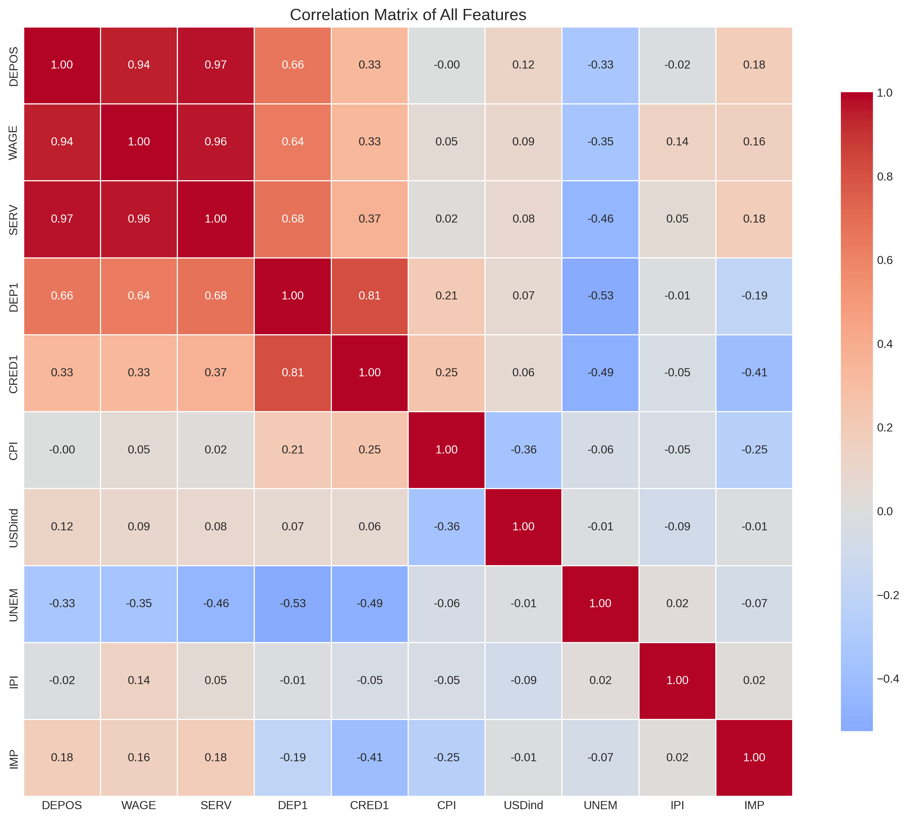
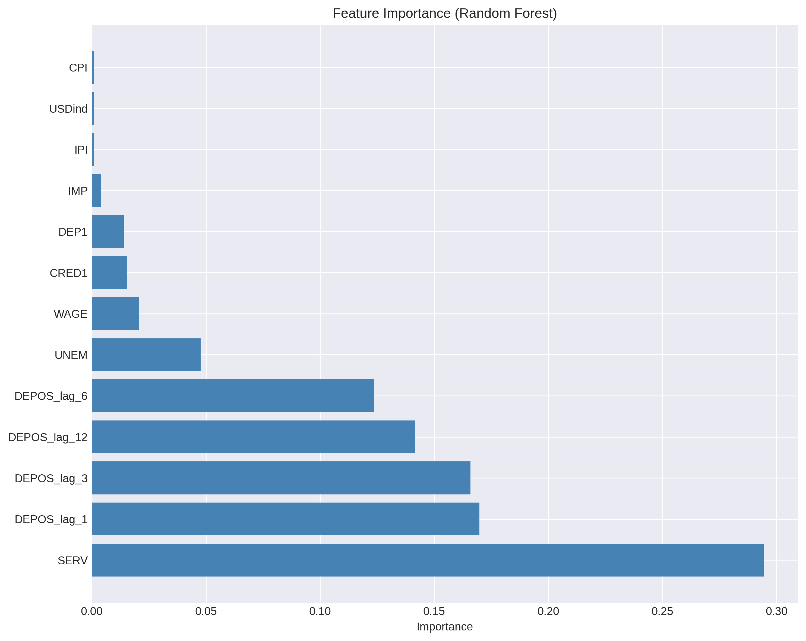
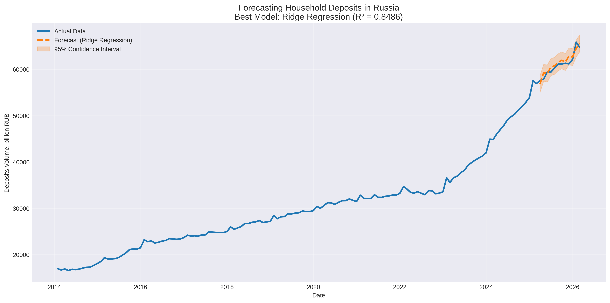

# Forecasting Household Deposits in Russia
## Macroeconomic Modeling & Time Series Analysis

**Keywords:** Time Series Forecasting, Macroeconomic Analysis, Ridge Regression, Econometrics, Python, Machine Learning, Household Deposits, Russia

---

### 📌 Project Overview

This project is part of my Data Science portfolio. It demonstrates the application of classical econometric techniques and modern machine learning algorithms to forecast the volume of household deposits in Russia.

**Core Competencies Demonstrated:**
- **Statistical Modeling:** Linear regression, Ridge regularization, hypothesis testing
- **Econometric Analysis:** Multicollinearity diagnostics (VIF), stationarity testing (ADF), autocorrelation analysis (Durbin-Watson)
- **Data Science Pipeline:** Data cleaning, feature engineering (lags, transformations), model comparison, visualization
- **Tools:** Python (pandas, scikit-learn, statsmodels), Jupyter Notebook

**Project Goal:**
- Forecast **DEPOS** (household deposits, billion RUB) using macroeconomic indicators
- Compare classical (Linear, Ridge) vs. non-linear (Random Forest) approaches
- Identify key macroeconomic drivers of deposit behavior

---

### 🎯 Business Problem

Understanding and predicting the volume of household deposits is crucial for financial institutions, policymakers, and investors. It helps in:
- Strategic planning for banks and credit institutions
- Informing monetary policy decisions
- Analyzing saving behavior in response to economic changes

---

### 📊 Dataset

**Timeframe:** 2014 – 2026 (monthly data)

**Source:** Data from data.vavt.ru

**Files:**
- `raw_deposits_data_2014_2026.xlsx` — original data as downloaded from the source
- `processed_deposits_data.xlsx` — cleaned data used for modeling (includes feature engineering)

**Target Variable:**
- `DEPOS`: Volume of household deposits and other attracted funds (billion RUB)

**Features (Predictors):**
| Feature | Description | Unit |
|---------|-------------|------|
| `WAGE` | Average nominal monthly wage | RUB |
| `SERV` | Volume of paid services to the population | Billion RUB |
| `DEP1` | Deposit rates: 1-3 year terms | % per annum |
| `CRED1` | Consumer credit rates: up to 1 year | % per annum |
| `CPI` | Consumer Price Index (inflation) | % change (monthly) |
| `USDind` | Nominal USD/RUB exchange rate index | % change (monthly) |
| `UNEM` | Registered unemployment rate | % |
| `IPI` | Industrial Production Index | % change (monthly) |
| `IMP` | Import of goods | % change (YoY) |

---

### 🧠 Models Implemented

To compare the effectiveness of different approaches, I implemented and evaluated three models:

1. **Linear Regression** – Interpretable baseline model (traditional econometric method)
2. **Ridge Regression** – Regularized linear model (handles multicollinearity)
3. **Random Forest** – Ensemble non-linear method (captures complex interactions)

**Evaluation Metrics:**
- R² (R-squared) – proportion of variance explained
- MAE (Mean Absolute Error) – average prediction error (billion RUB)
- RMSE (Root Mean Square Error) – penalizes larger errors

---

### 📈 Results & Key Findings

**Best Performing Model:** Ridge Regression (alpha=1.0)

**Performance Metrics (Test Set):**

| Model | R² | MAE (Billion RUB) | RMSE (Billion RUB) |
|-------|----|--------------------|---------------------|
| Linear Regression (full) | 0.8433 | 754.08 | 931.99 |
| Linear Regression (reduced)* | 0.8474 | 736.24 | 919.85 |
| **Ridge Regression (alpha=1.0)** | **0.8486** | **807.96** | **916.32** |
| Ridge Regression (alpha=0.001) | 0.8433 | 807.96 | 932.05 |
| Random Forest | -7.4829 | 6319.14 | 6858.17 |

*Reduced model uses only significant features (p < 0.05): WAGE, CPI, USDind, IPI, DEPOS_lag_1*

**Top 5 Drivers of Household Deposits (Ridge):**
1. **DEPOS_lag_1** (+4153.97) — strongest positive effect (past month deposits)
2. **DEPOS_lag_3** (+2177.65) — positive effect (3-month lag)
3. **DEPOS_lag_6** (+1058.05) — positive effect (6-month lag)
4. **SERV** (+591.35) — volume of paid services
5. **DEP1** (+434.42) — deposit rates

**Top Draggers (decrease deposits):**
1. **IPI** (-378.23) — industrial production index
2. **USDind** (-198.66) — USD exchange rate
3. **CPI** (-167.89) — inflation

**Interesting observation:**
- **CRED1** (+88.94) and **IMP** (+25.99) have slight positive effects (not draggers)
- All coefficients align with economic intuition: higher rates → more deposits, higher inflation → less deposits

**Statistical Diagnostics:**
- **Durbin-Watson Statistic:** 2.048 (Ideal ≈ 2.0) ✅
- **Multicollinearity (VIF):** Detected high collinearity → justifies use of Ridge regularization
- **Stationarity (ADF test):** p-value = 0.9813 → series is non-stationary ❌

**Note on Random Forest:** 
The model underperformed (R² = -7.48) due to:
- Small sample size (134 training records)
- Time series nature of the data (trees don't capture temporal order)
- This demonstrates the importance of choosing appropriate models for time series data

**📊 For a complete analysis with detailed visualizations and economic interpretations, see [key_insights.md](key_insights.md).**

**📊 For model interpretation (SHAP analysis & nonlinearity testing), see [key_insights_3.md](key_insights_3.md).**

---

### 🔍 Key Insights (Summary)

| Insight | Finding |
|---------|---------|
| **Best Model** | Ridge Regression (R² = 0.8486) |
| **Top Driver** | Past month deposits (DEPOS_lag_1) — strongest predictor |
| **Economic Drivers** | Higher wages, service volume, and deposit rates increase deposits |
| **Economic Draggers** | Inflation, USD exchange rate, and industrial production decrease deposits |
| **Model Lesson** | Simple regularized models (Ridge) outperform complex models (Random Forest) on small time series data |

**📊 Full analysis with detailed visualizations available in [key_insights.md](key_insights.md).**

---

### 📁 Project Structure
<details>
<summary><b>Нажмите, чтобы развернуть структуру проекта</b></summary>

```
deposits_forecast_project/
├── data/
│ ├── raw_deposits_data_2014_2026.xlsx     # Original data (raw, before processing)
│ └── processed_deposits_data.xlsx         # Cleaned and preprocessed data
├── notebooks/
│ └── 01_EDA_Modeling_Deposits_Forecast.ipynb
│ └── 01_EDA_Modeling_Deposits_Forecast_Ru.ipynb
│ └── 02_Deep_Analysis_Deposits_Forecast_Ru.ipynb
│ ├── 03_Model_Interpretation_Deposits_Forecast_Ru.ipynb
│ └── 04_Feature_Engineering_Deposits_Forecast_Ru.ipynb
├── outputs/
│ ├── v1/
│ │ ├── forecast_results.csv
│ │ ├── model_metrics.csv
│ │ ├── forecast_plot.png
│ │ ├── correlation_matrix.png
│ │ ├── feature_importance.png
│ │ ├── scatter_plots.png
│ │ ├── actual_vs_predicted.png
│ │ ├── depos_distribution.png
│ │ └── time_series_all.png
│ └── v2/
│ ├── 02_decomposition_additive.png
│ ├── 02_depos_trend.png
│ ├── 02_seasonal_component.png
│ ├── 02_structural_break_analysis.png
│ ├── 03_shap_summary.png
│ ├── 03_shap_importance.png
│ ├── 03_shap_dependence.png
│ ├── 04_anomaly_wage.png
│ ├── 04_covid_unem.png
│ └── 04_regime_cred1.png
├── README.md
├── key_insights.md
├── key_insights_2.md
├── key_insights_3.md
├── key_insights_4.md
└── requirements.txt
```

</details>

### 📊 Output Files Description

#### v1 — Baseline Models

<details>
<summary><b>📊 Output Files Description (v1)</b> (нажмите, чтобы развернуть)</summary>

| File | Description |
|------|-------------|
| `forecast_results.csv` | Monthly deposit forecast values |
| `model_metrics.csv` | Model performance metrics (RMSE, MAE, R²) |
| `forecast_plot.png` | Visualization of forecast results |
| `correlation_matrix.png` | Correlation matrix of features |
| `feature_importance.png` | Feature importance analysis |
| `scatter_plots.png` | Scatter plots of key variables |
| `actual_vs_predicted.png` | Comparison of actual vs predicted values |
| `depos_distribution.png` | Distribution of deposits over time |
| `time_series_all.png` | Complete time series visualization |

</details>

#### v2 — Deep Analysis & Feature Engineering

<details>
<summary><b>📊 Output Files Description (v2)</b> (нажмите, чтобы развернуть)</summary>

| File | Description |
|------|-------------|
| `02_decomposition_additive.png` | Time series decomposition (trend + seasonality + residuals) |
| `02_structural_break_analysis.png` | Chow test: trend change after December 2022 |
| `03_shap_summary.png` | SHAP feature importance and direction of influence |
| `04_anomaly_wage.png` | Wage anomaly detection (-2σ threshold) |
| `04_regime_cred1.png` | Two-regime CRED1 clusters (split by DEPOS) |

</details>

---

### 🛠️ Technology Stack

- **Language:** Python 3.9+
- **Libraries:** pandas, numpy, matplotlib, seaborn, scikit-learn, statsmodels
- **Environment:** Jupyter Notebook / Google Colab
- **Platform:** GitHub (portfolio hosting)

---

### 📈 Visual Outputs

| Correlation Matrix | Feature Importance |
|--------------------|---------------------|
|  |  |

| Scatter Plots | Forecast Plot |
|---------------|---------------|
|  |  |

| Decomposition of Time Series |
|------------------------------|
|  |
**For detailed analysis, see [key_insights_2.md](key_insights_2.md).**

| SHAP Summary (Feature Impact) |
|------------------------------|
|  |
**For detailed analysis, see [key_insights_3.md](key_insights_3.md).**

---

### 💡 Future Work

- ✅ **Completed:** Deep time series analysis ([key_insights_2.md](key_insights_2.md))
- ✅ **Completed:** Feature engineering & model improvement ([key_insights_3.md](key_insights_3.md))
- ✅ **Completed:** Seasonal components (monthly dummies added and tested) ([key_insights_4.md](key_insights_4.md))
- Test SARIMA or Prophet for explicit time series modeling
- Explore LSTM for sequential prediction
- Containerize with Docker + API for real-time inference

**Note:** `key_insights_2.md`, `key_insights_3.md`, and `key_insights_4.md` are currently in Russian. English versions will be added upon project completion.

---

### 👤 About the Author

I'm a data analyst specializing in statistical modeling and econometric analysis.

**Core Expertise:**
- Multivariate regression & hypothesis testing
- Time series forecasting & panel data analysis
- Data visualization & interpretation

**Professional Background:**
- Self-employed data analyst & statistics educator (registered as self-employed since 2019)
- Extensive experience translating complex quantitative concepts into actionable insights
- Currently expanding skills into Python-based Data Science & Machine Learning

**Connect:**
- **GitHub:** [HopeSilkina](https://github.com/HopeSilkina)
- **Email:** [tansion@mail.ru](mailto:tansion@mail.ru)
