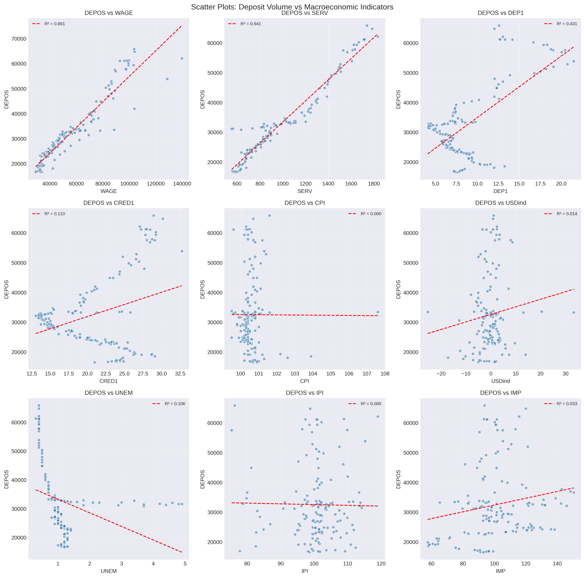
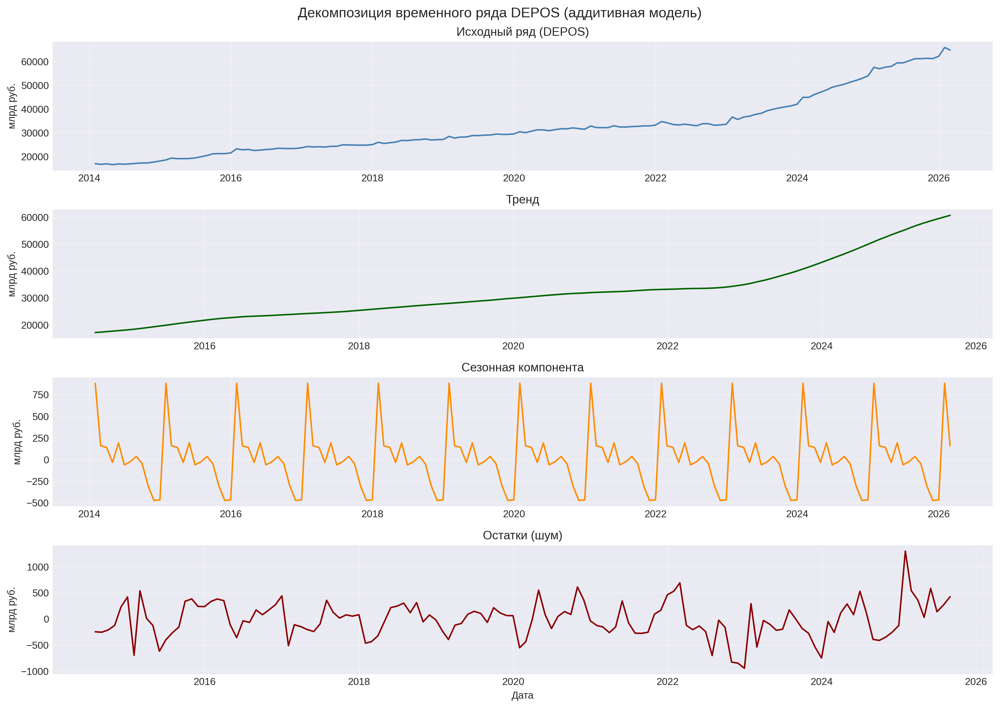

# Forecasting Household Deposits in Russia
## Macroeconomic Modeling & Time Series Analysis

**Keywords:** Time Series Forecasting, Macroeconomic Analysis, Ridge Regression, SARIMA, Econometrics, Python, Machine Learning, Household Deposits, Russia

---

### 📌 Project Overview

This project is the culmination of a comprehensive data science pipeline aimed at forecasting the volume of household deposits in Russia. It showcases the application of classical econometric techniques and modern machine learning algorithms, moving from exploratory analysis to a final, actionable forecast.

**Core Competencies Demonstrated:**
- **Statistical & Econometric Modeling:** Linear & Ridge Regression, SARIMA, Hypothesis Testing, Feature Engineering.
- **Advanced Analysis:** Time Series Decomposition, Structural Break Detection (Chow Test), SHAP Model Interpretation.
- **Data Science Pipeline:** EDA, Data Cleaning, Stationarity Testing (ADF/KPSS), Multicollinearity Diagnostics (VIF).
- **Tools:** Python (pandas, scikit-learn, statsmodels, SHAP), Jupyter Notebook, Git.

**Project Structure (6 Key Stages):**
1.  **EDA & Baseline Models:** Analysis of correlations and baseline Ridge Regression → [📊 Full Report](key_insights.md)
2.  **Deep Time Series Analysis:** Trend, seasonality decomposition, and Chow test for structural breaks → [📊 Full Report](key_insights_2.md)
3.  **Model Interpretation:** SHAP analysis to identify key drivers and nonlinearity testing → [📊 Full Report](key_insights_3.md)
4.  **Feature Engineering:** Creation of 38 features to significantly boost model performance → [📊 Full Report](key_insights_4.md)
5.  **Time Series Modeling (SARIMA):** Addressing autocorrelation and building a combined model → [📊 Full Report](key_insights_5.md)
6.  **Final Forecast:** Scenario-based forecasting for 2026-2027 with confidence intervals → [📊 Full Report](key_insights_6_itog.md)

**Project Goal:** Develop a robust forecasting model for `DEPOS` (household deposits in billion RUB) and identify key macroeconomic drivers to inform financial and policy decisions.

---

### 🎯 Business Problem

Understanding and predicting household deposits is vital for:
- **Financial Institutions:** Strategic planning, liquidity management, and setting deposit rates.
- **Policymakers:** Informing monetary policy and assessing the impact of economic changes on savings.
- **Investors:** Evaluating the attractiveness of the banking sector and the broader economy.

---

### 📊 Dataset

- **Timeframe:** January 2014 – February 2026 (146 monthly observations).
- **Source:** Data from data.vavt.ru.
- **Target Variable:** `DEPOS` — Volume of household deposits (billion RUB).
- **Key Features (Predictors):**
    - `WAGE`: Average nominal monthly wage (RUB).
    - `SERV`: Volume of paid services to the population (Billion RUB).
    - `DEP1`: Deposit rates for 1-3 year terms (% per annum).
    - `CRED1`: Consumer credit rates up to 1 year (% per annum).
    - `CPI`: Consumer Price Index (inflation, % change).
    - `USDind`: Nominal USD/RUB exchange rate index (% change).
    - `UNEM`: Registered unemployment rate (%).
    - `IPI`: Industrial Production Index (% change).
    - `IMP`: Import of goods (% change, YoY).

---

### 🧠 Models & Methodology

Several approaches were implemented and compared across the 6 project blocks ([Block 1](key_insights.md), [Block 4](key_insights_4.md), [Block 5](key_insights_5.md)):

| Model Type | Key Findings |
| :--- | :--- |
| **Baseline (OLS, Ridge)** | Best baseline model: **Ridge (alpha=1.0)** achieved R²_test = 0.8486 ([details](key_insights.md#7-model-performance-comparison)). |
| **Feature Engineering** | Added 25 new features (lags, seasonality dummies, `post_2022`). **Full Ridge (38 features)** achieved R²_test = 0.9422 ([details](key_insights_4.md#3-результаты-модели-с-новыми-признаками)). |
| **Random Forest** | Failed significantly (R²_test = -7.48) due to the small sample size and time series nature of the data, highlighting the importance of model selection. |
| **SARIMA/SARIMAX** | SARIMA successfully eliminated autocorrelation but failed on forecasting (R²_test < 0). SARIMAX with exogenous variables suffered severe overfitting ([details](key_insights_5.md#10-итоговое-сравнение-всех-моделей)). |
| **Combined Model** | **Ridge + SARIMA** successfully removed residual autocorrelation from the Ridge model (Ljung-Box p = 0.2982), making it the best choice for **interval forecasting**. |

**Final Conclusion:** The **Full Ridge (38 features) model from Block 4** was selected as the best for point forecasting ([Block 4](key_insights_4.md#7-итоговые-выводы)). The **Combined (Ridge + SARIMA) model** was recommended for interval forecasting due to its uncorrelated residuals ([Block 5](key_insights_5.md#11-итоговые-выводы)).

---

### 📈 Final Results & Key Insights

#### 🏆 Best Performing Model (Point Forecast)
- **Model:** Full Ridge Regression (alpha=1.0) with 38 engineered features ([Block 4](key_insights_4.md)).
- **Training Period:** Jan 2015 – Feb 2026 (134 observations).
- **Test Performance (Block 4, Mar 2025 – Feb 2026):**
    - **R²_test:** **0.9422** (explains ~94% of variance)
    - **RMSE:** 566.09 billion RUB
    - **MAE:** 489.89 billion RUB
    - **Training R²:** 0.9987 (AIC: 1875.54)
    - **Overfitting Gap (R²_train - R²_test):** 0.0565 (minimal).

#### 🔍 Key Drivers of Household Deposits
Based on SHAP analysis and Ridge coefficients from the baseline model ([Block 1](key_insights.md#8-ridge-regression-coefficients-what-drives-household-deposits) & [Block 3](key_insights_3.md#1-shap-анализ-ridge-регрессия)):
- **Top Positive Drivers:** Past deposits (`DEPOS_lag_1`, `lag_3`, `lag_6`), Economic activity (`SERV`), and Deposit rates (`DEP1`).
- **Top Negative Drivers:** Inflation (`CPI`), USD exchange rate (`USDind`), and Industrial production (`IPI`).
- **Structural Shift:** A significant trend acceleration after December 2022 was confirmed by a Chow Test (p < 0.05) ([Block 2](key_insights_2.md#2-структурные-изменения)). The `post_2022` dummy variable was a crucial improvement, adding +0.0427 to R²_test ([Block 4](key_insights_4.md#4-анализ-каждого-нового-признака)).

#### 📊 Final Forecast for 2026-2027
The final forecast was generated under three macroeconomic scenarios ([Block 6](key_insights_6_itog.md#4-сценарии-макрофакторов)):

| Scenario | Forecasted DEPOS (Feb 2027) | 12-Month Growth (from Feb 2026) |
| :--- | :--- | :--- |
| **Baseline (Most Likely)** | **70,046** billion RUB | **+8.1%** |
| **Optimistic** | 70,934 billion RUB | +9.5% |
| **Pessimistic** | 69,353 billion RUB | +7.0% |
| **95% Confidence Interval (Baseline)** | 69,350 — 70,742 billion RUB | — |

*Current level (Feb 2026): 64,794 billion RUB.*

---

### 💡 Key Takeaways

1.  **Model Selection is Crucial:** Simple, regularized models (Ridge) significantly outperformed complex ones (Random Forest) and pure time-series models (SARIMA) on this small macroeconomic dataset.
2.  **Feature Engineering is Key:** Adding lags, seasonal dummies, and a structural break variable (`post_2022`) boosted R²_test by **+9.36 percentage points** (from 0.8486 to 0.9422) ([Block 4](key_insights_4.md#3-результаты-модели-с-новыми-признаками)).
3.  **Addressing Autocorrelation:** The combined Ridge + SARIMA model successfully handled the seasonal autocorrelation (lag 4) that was present in all pure regression models, providing statistically sound residuals for interval forecasting ([Block 5](key_insights_5.md#8-комбинированная-модель-полная-ridge--sarima)).
4.  **Economic Intuition is Validated:** The direction of influence for all key drivers (e.g., wages, inflation, rates) aligns perfectly with economic theory.

---

### 📁 Project Structure
<details>
<summary><b>Нажмите, чтобы развернуть структуру проекта</b></summary>

```
deposits_forecast_project/
├── data/
│ ├── raw_deposits_data_2014_2026.xlsx          # Original data (raw, before processing)
│ └── processed_deposits_data.xlsx              # Cleaned and preprocessed data
├── notebooks/                   # 6 Analysis Blocks
│ ├── 01_EDA_Modeling_Deposits_Forecast_En.ipynb
│ ├── 01_EDA_Modeling_Deposits_Forecast_Ru.ipynb
│ ├── 02_Deep_Analysis_Deposits_Forecast_En.ipynb
│ ├── 02_Deep_Analysis_Deposits_Forecast_Ru.ipynb
│ ├── 03_Model_Interpretation_Deposits_Forecast_En.ipynb
│ ├── 03_Model_Interpretation_Deposits_Forecast_Ru.ipynb
│ ├── 04_Feature_Engineering_Deposits_Forecast_En.ipynb
│ ├── 04_Feature_Engineering_Deposits_Forecast_Ru.ipynb
│ ├── 05_SARIMA_Modeling_Deposits_Forecast_En.ipynb
│ ├── 05_SARIMA_Modeling_Deposits_Forecast_Ru.ipynb
│ ├── 06_Final_Forecast_Deposits_2026_2027_En.ipynb
│ └── 06_Final_Forecast_Deposits_2026_2027_Ru.ipynb
├── outputs/
│ ├── v1/                      # Baseline Model Outputs
│ │ ├── 01_forecast_results.csv
│ │ ├── 01_model_metrics.csv
│ │ ├── 01_diagnostics_best_model.png
│ │ ├── 01_forecast_plot.png
│ │ ├── 01_correlation_matrix.png
│ │ ├── 01_feature_importance.png
│ │ ├── 01_scatter_plots.png
│ │ ├── 01_actual_vs_predicted.png
│ │ ├── 01_depos_distribution.png
│ │ └── 01_time_series_all.png
│ └── v2/                       # Deep Analysis & Final Outputs
│ ├── 02_decomposition_additive.png
│ ├── 02_depos_trend.png
│ ├── 02_seasonal_component.png
│ ├── 02_structural_break_analysis.png
│ ├── 03_shap_summary.png
│ ├── 03_shap_importance.png
│ ├── 03_shap_dependence.png
│ ├── 04_anomaly_wage.png
│ ├── 04_covid_unem.png
│ ├── 04_regime_cred1.png
│ ├── 04_residuals_diagnostics_Manual_removal.png
│ ├── 05_acf_pacf_analysis.png
│ ├── 05_combined_model_comparison.png
│ ├── 05_depos_series.png
│ ├── 05_diff_analysis.png
│ ├── 05_sarima_diagnostics.png
│ ├── 05_sarima_forecast.png
│ ├── 05_sarimax_comparison.png
│ ├── 05_sarimax_key_comparison.png
│ ├── 06_final_forecast_2026_2027.png
│ └── 06_forecast_2026_2027.csv
├── README.md
├── key_insights.md
├── key_insights_2.md
├── key_insights_3.md
├── key_insights_4.md
├── key_insights_5.md
├── key_insights_6.md
└── requirements.txt
```

</details>

### 📊 Output Files Description

<details>
<summary><b>v1 — Baseline Models(v1)</b> (нажмите, чтобы развернуть)</summary>

| File | Description |
|------|-------------|
| `01_diagnostics_best_model.png` | Residual diagnostics: histogram, Q-Q plot, residuals vs fitted, ACF |
| `01_correlation_matrix.png` | Correlation matrix of all features |
| `01_scatter_plots.png` | Scatter plots of DEPOS vs all predictors |
| `01_feature_importance.png` | Feature importance analysis (Ridge coefficients) |
| `01_forecast_plot.png` | Visualization of forecast results |
| `01_forecast_results.csv` | Monthly deposit forecast values |
| `01_model_metrics.csv` | Model performance metrics (RMSE, MAE, R²) |
| `01_time_series_all.png` | Complete time series visualization of all indicators |
| `01_actual_vs_predicted.png` | Actual vs predicted values scatter plot |
| `01_depos_distribution.png` | Distribution of target variable (DEPOS) |

</details>

<details>
<summary><b>v2 — Deep Analysis & Feature Engineering(v2)</b> (нажмите, чтобы развернуть)</summary>

| File | Description |
|------|-------------|
| `02_decomposition_additive.png` | Time series decomposition (trend + seasonality + residuals) |
| `02_structural_break_analysis.png` | Chow test: trend change after December 2022 |
| `03_shap_summary.png` | SHAP feature importance and direction of influence |
| `03_shap_dependence.png` | SHAP dependence plots for key features |
| `04_anomaly_wage.png` | Wage anomaly detection (-2σ threshold) |
| `04_covid_unem.png` | COVID-19 period in UNEM scatter plot |
| `04_regime_cred1.png` | Two-regime CRED1 clusters (tested and rejected) |
| `05_acf_pacf_analysis.png` | ACF/PACF for stationarity and seasonality analysis |
| `05_diff_analysis.png` | Differencing analysis (d=0, d=1, d=2) |
| `05_sarima_diagnostics.png` | SARIMA residual diagnostics |
| `05_combined_model_comparison.png` | Ridge vs Combined (Ridge + SARIMA) comparison |
| `06_final_forecast_2026_2027.png` | Final forecast plot with three scenarios |
| `06_forecast_2026_2027.csv` | Final forecast data with scenarios and confidence intervals |

</details>

---

### 🛠️ Technology Stack

- **Language:** Python 3.9+
- **Libraries:** `pandas`, `numpy`, `matplotlib`, `seaborn`, `scikit-learn`, `statsmodels`, `shap`
- **Environment:** Jupyter Notebook / Google Colab
- **Platform:** GitHub (portfolio hosting)

---

### 📈 Visual Outputs

| Correlation Matrix | Feature Importance |
|:---:|:---:|
| [](outputs/v1/01_correlation_matrix.png) | [](outputs/v1/01_feature_importance.png) |

| Scatter Plots | Forecast Plot |
|:---:|:---:|
| [](outputs/v1/01_scatter_plots.png) | [](outputs/v1/01_forecast_plot.png) |

| Decomposition of Time Series | SHAP Summary (Feature Impact) |
|:---:|:---:|
| [](outputs/v2/02_decomposition_additive.png)<br>*For detailed analysis, see [key_insights_2.md](key_insights_2.md)* | [](outputs/v2/03_shap_summary.png)<br>*For detailed analysis, see [key_insights_3.md](key_insights_3.md)* |

| Combined Model Comparison | Final Forecast (2026-2027) |
|:---:|:---:|
| [](outputs/v2/05_combined_model_comparison.png)<br>*For detailed analysis, see [key_insights_5.md](key_insights_5.md)* | [](outputs/v2/06_final_forecast_2026_2027.png)<br>*For detailed analysis, see [key_insights_6_itog.md](key_insights_6_itog.md)* |

---

### 👤 About the Author

I'm a data analyst specializing in statistical modeling and econometric analysis.

**Core Expertise:**
- Multivariate regression & hypothesis testing
- Time series forecasting & panel data analysis
- Data visualization & interpretation

**Professional Background:**
- Self-employed data analyst & statistics educator (registered as self-employed since 2019)
- Extensive experience translating complex quantitative concepts into actionable insights
- Currently expanding skills into Python-based Data Science & Machine Learning

**Connect:**
- **GitHub:** [HopeSilkina](https://github.com/HopeSilkina)
- **Email:** [tansion@mail.ru](mailto:tansion@mail.ru)
