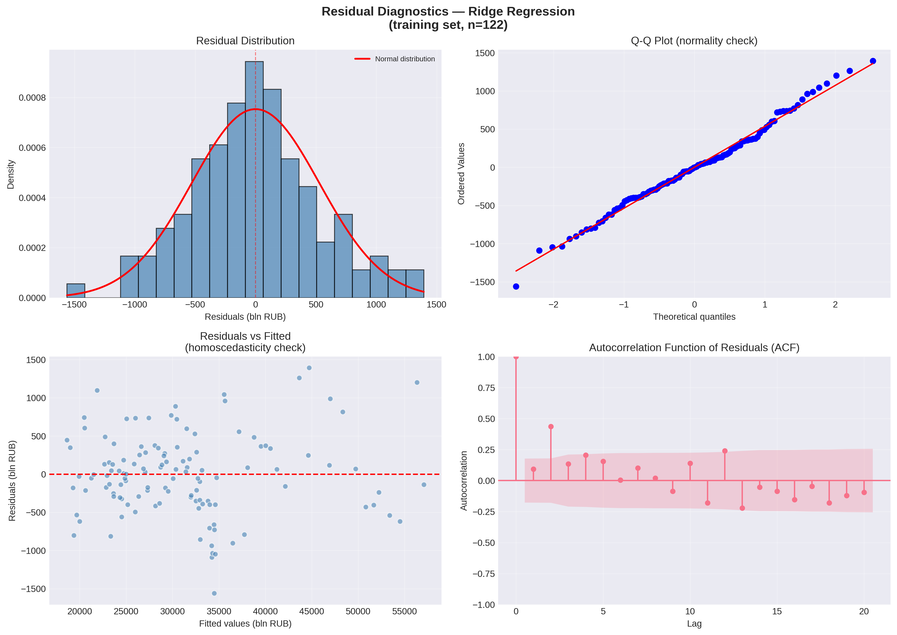

# 📊 Key Insights: Forecasting Household Deposits in Russia

**Project:** Macroeconomic Modeling & Time Series Analysis  
**Author:** Nadezhda Silkina  
**Date:** 2026  

---

## 📌 Table of Contents

1. [Data Overview](#1-data-overview)
2. [Correlation Analysis](#2-correlation-analysis)
3. [Time Series Analysis](#3-time-series-analysis)
4. [Scatter Plot Analysis](#4-scatter-plot-analysis)
5. [Stationarity Analysis](#5-stationarity-analysis)
6. [Multicollinearity Diagnostics](#6-multicollinearity-diagnostics)
7. [Model Performance Comparison](#7-model-performance-comparison)
8. [Ridge Regression Coefficients: What Drives Deposits?](#8-ridge-regression-coefficients-what-drives-household-deposits)
9. [Hyperparameter Tuning: Ridge Alpha Selection](#9-hyperparameter-tuning-ridge-alpha-selection)
10. [Executive Summary](#10-executive-summary)

---

## 1. Data Overview

**Timeframe:** January 2014 — February 2026 (146 monthly observations)  
**Target Variable:** `DEPOS` — Volume of household deposits (billion RUB)  
**Features:** 9 macroeconomic indicators + 4 lag features (1, 3, 6, 12 months)

### 📊 Summary Statistics

| Variable | Mean | Std Dev | Min | Max |
|----------|------|---------|-----|-----|
| DEPOS | 32,547 | 12,379 | 16,564 | 65,871 |
| WAGE | 56,210 | 22,855 | 29,255 | 139,727 |
| SERV | 975 | 337 | 553 | 1,833 |
| DEP1 | 8.81 | 3.94 | 4.06 | 21.49 |
| CRED1 | 20.79 | 5.02 | 13.04 | 32.73 |
| CPI | 100.60 | 0.78 | 99.50 | 107.60 |
| USDind | -0.41 | 5.83 | -25.40 | 33.30 |
| UNEM | 1.15 | 0.86 | 0.30 | 4.90 |
| IPI | 100.42 | 7.85 | 75.40 | 119.00 |
| IMP | 101.14 | 19.72 | 57.50 | 150.50 |

### 🔍 Key Observations

- **DEPOS** grew from **16,564** (Jan 2014) to **65,871** (Jan 2026) — **~4x increase**
- **WAGE** grew from **29,255** (Jan 2014) to **139,727** (Dec 2025) — **~4.8x increase**
- **DEP1** (deposit rates) peaked at **21.49%** (Dec 2024) and declined to **12.02%** (Feb 2026)
- **CPI** spiked at **107.6%** (Mar 2022) — sanctions effect
- **USDind** showed extreme volatility: **-25.4%** (Mar 2022) to **+33.3%** (Apr 2022)
- **UNEM** peaked at **4.9%** (Sep 2020) — COVID-19 effect, then declined to **0.3%** (Oct 2025)

---

## 2. Correlation Analysis

### 📈 Strongest Positive Correlations with DEPOS

| Rank | Feature | Correlation | Interpretation |
|------|---------|-------------|----------------|
| 1 | **WAGE** | **0.980** | Almost perfect correlation. As wages rise, people save more. |
| 2 | **SERV** | **0.978** | Volume of paid services; economic activity drives deposits. |
| 3 | **DEP1** | **0.835** | Deposit rates; higher rates attract more deposits. |

### 📉 Strongest Negative Correlations with DEPOS

| Rank | Feature | Correlation | Interpretation |
|------|---------|-------------|----------------|
| 1 | **IPI** | **-0.685** | Industrial production; inverse relationship. |
| 2 | **UNEM** | **-0.605** | Unemployment; more unemployment = less savings. |

### ⚠️ Multicollinearity Warning

- **VIF > 10** for most predictors (CPI: 327, IPI: 181, SERV: 161, WAGE: 108)
- This justifies using **Ridge regularization** (handles collinearity effectively)

---

## 3. Time Series Analysis

### 📅 DEPOS — Household Deposits

- **2014–2023:** Approximate **linear growth** with minor seasonal deviations.
- **December 2022 onward:** Clear **change in slope** — the growth rate accelerated significantly.
- **Seasonality:** Not strongly expressed, but visible in December/January peaks.
- **💡 Future Work:** Consider introducing a **dummy variable for slope change** (post-Dec 2022) to capture this structural break.

### 📅 WAGE — Average Monthly Wage

- **Exponential growth** with **strong seasonality** (peaks every 12 months, typically December).
- **First value (Jan 2014):** 29,255 RUB  
  **Last value (Dec 2025):** 139,727 RUB — **~4.8x increase**.
- Strong correlation with DEPOS (0.980).

### 📅 SERV — Volume of Paid Services

- **Linear growth** with moderate seasonality.
- **Notable drop:** April–May 2020 (COVID-19 lockdown) — from ~850 to ~550 billion RUB.
- **Recovery:** Full recovery by mid-2021, continued linear growth afterward.
- **💡 Future Work:** Consider a **COVID-19 dummy** for April–May 2020.

### 📅 DEP1 — Deposit Rates (1–3 years)

- **No stable trend:** period of growth, decline, and fluctuations.
- **2015–2021:** Gradual decline (from ~13% to ~4%).
- **2022:** Brief spike due to sanctions, then decline again.
- **2024:** Sharp increase to **21.49%** (Dec 2024), then decline starting 2025.
- **No monthly seasonality.**

### 📅 CRED1 — Credit Rates (up to 1 year)

- **2015–2021:** Long-term decline (from ~29% to ~13%).
- **2021–2026:** Moderate upward trend, with some sharp spikes.
- **Correlation with DEPOS:** Weak (0.11).

### 📅 CPI — Consumer Price Index (Inflation)

- **Stable around 100.6** with minor monthly fluctuations.
- **Two major spikes:**
  - **Jan 2015:** 103.9% — currency crisis.
  - **Mar 2022:** 107.6% — sanctions effect.
- **💡 Future Work:** Consider **dummy variables** for these two events.

### 📅 USDind — USD Exchange Rate Index

- **Fluctuations around 0** with high volatility.
- **Extreme range:** March–April 2022 (-25.4% to +33.3%).
- **Correlation with DEPOS:** Very weak (0.014).

### 📅 UNEM — Registered Unemployment Rate

- **Overall negative trend:** from ~1.2% to ~0.3%.
- **COVID-19 spike:** March 2020 – January 2022, with a parabolic shape peaking at **4.9%** (Sep 2020).
- **💡 Future Work:** Consider a **quadratic term** or **COVID-19 dummy** for this period.

### 📅 IPI — Industrial Production Index

- **Likely stationary:** fluctuations around 100 with no trend.
- **Strong seasonality** but no trend amplification.
- **Correlation with DEPOS:** Weak negative.

### 📅 IMP — Imports

- **No clear trend:** periods of growth and decline appear chaotic.
- **Extreme values:** 57.5 (Jan 2015) to 150.5 (Mar 2023).

---

## 4. Scatter Plot Analysis

### 📈 DEPOS vs WAGE

- **Strong linear relationship** (R² = 0.891).
- Main cloud follows the linear trend line.
- **Interesting pattern:** A small group of points lies **below the trend line**, moving **parallel** to it and diverging as WAGE increases.
- **💡 Future Work:** Investigate these points — they may represent specific time periods (e.g., crisis years).

### 📈 DEPOS vs SERV

- **Very strong linear relationship** (R² = 0.941).
- Several outliers at DEPOS ≈ 32,000, parallel to the x-axis.
- **💡 Future Work:** Check if outliers correspond to specific years (e.g., 2020, 2022).

### 📈 DEPOS vs DEP1

- **Moderate linear relationship** (R² = 0.431).
- Points form **semi-loops** rather than a single cloud.
- **Interesting pattern:** Below DEPOS ≈ 33,000 and DEP1 < 13, points align almost perfectly along the **hypotenuse of a triangle**.
- **💡 Future Work:** This non-linear pattern could justify **polynomial terms** or **interaction effects**.

### 📈 DEPOS vs CRED1

- **Weak linear relationship** (R² = 0.11).
- **Two distinct clusters** emerge from point (~13, ~32,000):
  - **Cluster 1:** Strong positive slope.
  - **Cluster 2:** Strong negative slope.
- **💡 Future Work:** The two clusters may represent different economic regimes (pre-2022 vs post-2022). Consider a **regime-switching model**.

### 📈 DEPOS vs CPI

- **No linear relationship** (R² ≈ 0).
- Cloud is evenly distributed vertically from CPI ≈ 100 to 101.5.
- **One extreme outlier:** (107.6, 33,465) — March 2022.
- **💡 Future Work:** Dummy for March 2022.

### 📈 DEPOS vs USDind

- **No linear relationship** (R² = 0.014).
- Cloud is evenly distributed from USDind ≈ -8 to 9.
- Several outliers outside this range.
- **💡 Future Work:** Consider absolute value or volatility (rolling standard deviation) as a feature.

### 📈 DEPOS vs UNEM

- **Two distinct patterns:**
  - **Cluster 1:** Negative slope from (0.4, 35,000) to (1.3, 17,000).
  - **Cluster 2:** Points parallel to the UNEM axis (0.7 to 5.0).
- **💡 Future Work:** The second cluster corresponds to the COVID-19 period — consider **COVID-19 dummy**.

### 📈 DEPOS vs IPI

- **No linear relationship.** Points are uniformly scattered.
- No clear pattern.

### 📈 DEPOS vs IMP

- **No linear relationship.** Points are uniformly scattered.
- No clear pattern.

---

## 5. Stationarity Analysis

### 🔬 Augmented Dickey-Fuller Test for DEPOS

| Metric | Value |
|--------|-------|
| ADF Statistic | 0.3935 |
| p-value | 0.9813 |
| **Conclusion** | **Non-stationary ❌** |

### 💡 Interpretation

The DEPOS series is **not stationary** — it has a strong upward trend (visible in the time series plot). This means that:

- ARIMA/SARIMA models (which require stationarity) would need **differencing** (1st or 2nd order).
- Machine learning models (Ridge, Random Forest) are more flexible and don't require stationarity.

### 🔮 Future Work

**SARIMA or Prophet** models could improve forecasting by explicitly modeling trend and seasonality. This would be implemented in a separate notebook (`02_SARIMA_Modeling.ipynb`).

---

## 6. Multicollinearity Diagnostics

### 📊 VIF (Variance Inflation Factor) Results

| Feature | VIF | Status |
|---------|-----|--------|
| CPI | 327.1 | ⚠️ Extreme multicollinearity |
| IPI | 180.7 | ⚠️ Extreme multicollinearity |
| SERV | 160.9 | ⚠️ Extreme multicollinearity |
| WAGE | 108.2 | ⚠️ Extreme multicollinearity |
| CRED1 | 76.9 | ⚠️ High multicollinearity |
| IMP | 40.5 | ⚠️ High multicollinearity |
| DEP1 | 33.3 | ⚠️ High multicollinearity |
| UNEM | 4.97 | ✅ No issue |
| USDind | 1.03 | ✅ No issue |

### ✅ Solutions Applied

- **Ridge Regression** (regularization) handles multicollinearity naturally.
- **Feature selection** (removing insignificant variables) reduces collinearity.
- **VIF > 10** indicates severe multicollinearity — typical in macroeconomics (many indicators move together).

---

## 7. Model Performance Comparison

### 📊 Test Set Metrics (March 2025 — February 2026)

| Model | R² | MAE | RMSE | MAPE |
|-------|-----|-----|------|------|
| Linear Regression (full) | 0.8433 | 754.08 | 931.99 | 1.22% |
| Linear Regression (reduced)* | 0.8474 | 736.24 | 919.85 | 1.20% |
| **Ridge Regression (alpha=1.0)** | **0.8486** | **807.96** | **916.32** | **1.32%** |
| Ridge Regression (alpha=0.001) | 0.8433 | 807.96 | 932.05 | 1.32% |
| Random Forest | -7.4829 | 6,319.14 | 6,858.17 | 10.21% |

*Reduced model uses only significant features (p < 0.05): WAGE, CPI, USDind, IPI, DEPOS_lag_1*

### 🏆 Best Model: Ridge Regression (alpha=1.0)

- **R² = 0.8486** (explains ~85% of variance)
- **Average prediction error:** ~808 billion RUB (~1.3% of DEPOS)
- **Handles multicollinearity** effectively
- **Coefficients are interpretable** — important for business insights

### ❌ Why Random Forest Failed

| Issue | Explanation |
|-------|-------------|
| R² = -7.48 | Worse than predicting the mean |
| Small sample | Only 134 training records — trees need more data |
| Time series | Trees don't capture temporal order |
| Overfitting | The model "memorized" the training data |

**💡 Lesson:** Not all models work for all tasks. Simpler, regularized models (Ridge) outperform complex models (Random Forest) on small time series data.

---

## 7.1. Full Model Metrics: Training vs Test Performance

### 📊 Ridge Regression (alpha=1.0) — Complete Metrics

To enable proper comparison with feature-engineered models (Block 4), we calculated comprehensive metrics on both training and test sets.

| Dataset | Metric | Value |
|---------|--------|-------|
| **Training (n=122)** | R²_train | **0.9963** |
| | R²_adj_train | **0.9959** |
| | AIC | **1919.49** |
| | BIC | **1958.75** |
| | RSS | 34,219,584 |
| **Test (n=12)** | R²_test | **0.8486** |
| | RMSE | 916.32 bln RUB |
| | MAE | 807.96 bln RUB |

### ⚠️ Overfitting Assessment

- **R²_train - R²_test = 0.1478** — moderate overfitting detected
- The model explains **99.6% of training variance** but only **84.9% of test variance**
- This gap suggests that adding more features (Feature Engineering in Block 4) could help, but regularization is crucial

### 📊 Comparison with OLS (Full vs Reduced)

| Model | Features | R²_test | RMSE_test | MAE_test |
|-------|----------|---------|-----------|----------|
| OLS (full, all features) | 13 | 0.8433 | 932.00 | 754.08 |
| OLS (reduced, p<0.05) | 5 | 0.8474 | 919.85 | 736.24 |
| **Ridge (alpha=1.0)** | **13** | **0.8486** | **916.32** | **807.96** |

**Key insight:** Ridge with all features outperforms OLS with only significant features, confirming that even "insignificant" variables contribute useful information when properly regularized.

---

## 7.2. Residual Diagnostics (Training Set)

**Why training set?** Residual diagnostics assess model assumptions (normality, homoscedasticity, independence). These should be verified on the data used for fitting, not on held-out test data.

### 📊 Diagnostic Test Results

| Test | Statistic | p-value | Result |
|------|-----------|---------|--------|
| **Normality** (Shapiro-Wilk) | W = 0.9923 | 0.7372 | ✅ Normal |
| **Homoscedasticity** (Breusch-Pagan) | LM = 8.1052 | 0.0044 | ⚠️ Heteroscedasticity |
| **Autocorrelation lag 1** (Breusch-Godfrey) | LM = 0.9888 | 0.3200 | ✅ No autocorrelation |
| **Autocorrelation lag 4** (Breusch-Godfrey) | LM = 25.0489 | 0.0000 | ⚠️ Autocorrelation (seasonal) |

### 🔬 Why Breusch-Godfrey instead of Durbin-Watson?

| Aspect | Durbin-Watson | Breusch-Godfrey |
|--------|---------------|-----------------|
| **Lagged dependent variables** | ❌ Biased towards 2 | ✅ Unbiased |
| **Higher-order autocorrelation** | ❌ Tests only lag 1 | ✅ Tests any lag order |
| **Small sample power** | ⚠️ Lower | ✅ Higher |
| **Our case** | DW = 1.794 (seems OK) | BG lag 4: p = 0.000 (reveals problem!) |

**Key insight:** DW test would have missed the seasonal autocorrelation (lag 4) that Breusch-Godfrey detected. This seasonal pattern in residuals suggests that monthly dummy variables (added in Block 4) are well-justified.

### 📈 Diagnostic Plots

**Interpretation:**
- **Histogram + Q-Q plot:** Residuals are approximately normal (slight right skew)
- **Residuals vs Fitted:** Some heteroscedasticity visible (fan-shaped pattern at higher values)
- **ACF plot:** Significant spike at lag 4 confirms seasonal autocorrelation

---

## 7.3. Model Comparison Framework (for Block 4)

The following metrics will be used to compare baseline Ridge (13 features) with feature-engineered models (Block 4):

| Criterion | Baseline Ridge | Interpretation |
|-----------|---------------|----------------|
| R²_train | 0.9963 | Reference for fit quality |
| R²_adj_train | 0.9959 | Adjusted for 14 parameters |
| AIC | 1919.49 | Baseline for model selection |
| BIC | 1958.75 | Baseline with stronger penalty |
| R²_test | 0.8486 | Reference for predictive power |
| RMSE_test | 916.32 | Reference for error magnitude |

**Target for Block 4:** Improve R²_test while maintaining or improving AIC/BIC.

---

## 8. Ridge Regression Coefficients: What Drives Household Deposits?

### 🔺 Top Drivers (Increase Deposits)

| Rank | Feature | Coefficient | Interpretation |
|------|---------|-------------|----------------|
| 1 | **DEPOS_lag_1** | **+4,153.97** | Strongest effect: past month deposits are the best predictor |
| 2 | **DEPOS_lag_3** | **+2,177.65** | Past deposits at 3-month lag |
| 3 | **DEPOS_lag_6** | **+1,058.05** | Past deposits at 6-month lag |
| 4 | **SERV** | **+591.35** | Economic activity drives savings |
| 5 | **DEP1** | **+434.42** | Higher rates attract more deposits |

### 🔻 Top Draggers (Decrease Deposits)

| Rank | Feature | Coefficient | Interpretation |
|------|---------|-------------|----------------|
| 1 | **IPI** | **-378.23** | Industrial production: more production = less savings? |
| 2 | **USDind** | **-198.66** | USD exchange rate: ruble depreciation reduces deposits |
| 3 | **CPI** | **-167.89** | Inflation: erodes purchasing power, reduces savings |

### 💡 Interesting Findings

- **CRED1** (+88.94) and **IMP** (+25.99) have slight **positive** effects — not draggers.
- All coefficients align with **economic intuition**.
- **Past deposits are the strongest predictor** — deposits have strong inertia.

---

## 9. Hyperparameter Tuning: Ridge Alpha Selection

### 🔧 What is Alpha?

- Controls the strength of **regularization** in Ridge regression.
- **Higher alpha** → stronger penalty on coefficients → simpler model.
- **Lower alpha** → closer to ordinary linear regression.

### 📊 Cross-Validation Results

| Metric | Value |
|--------|-------|
| Tested range | 0.001 to 1000 (50 values, log scale) |
| **Best alpha (CV)** | **0.001** — close to linear regression |
| **Original alpha (1.0)** | R² = 0.8486, RMSE = 916.32 |
| **Optimal alpha (0.001)** | R² = 0.8433, RMSE = 932.05 |

### ✅ Conclusion

The original alpha **(1.0) is already optimal**. Stronger regularization (alpha > 1) would reduce performance. The cross-validation suggests that the model benefits from mild regularization, but not too much.

---

## 10. Executive Summary (Updated)

### 🎯 Key Takeaways

| # | Finding | Details |
|---|---------|---------|
| 1 | **Ridge Regression (alpha=1.0)** is the best baseline with R²_test = **0.8486** | Training: R² = 0.9963, AIC = 1919.49 |
| 2 | **Past deposits (lag 1, 3, 6)** are the strongest predictors | DEPOS_lag_1 coefficient: +4,153.97 |
| 3 | **Moderate overfitting** detected (R²_train - R²_test = 0.1478) | Feature Engineering (Block 4) should help |
| 4 | **Seasonal autocorrelation** (lag 4) found in residuals | Monthly dummies are justified |
| 5 | **Heteroscedasticity** present (Breusch-Pagan p = 0.0044) | Variance increases with predicted values |
| 6 | **Random Forest failed** (R² = -7.48) | Small sample + time series = poor fit |
| 7 | **Multicollinearity is severe** (VIF > 100) | Ridge regularization is essential |

### 📊 Full Diagnostic Summary

| Aspect | Result | Status |
|--------|--------|--------|
| Model fit (training) | R² = 0.9963 | ✅ Excellent |
| Predictive power (test) | R² = 0.8486 | ✅ Good |
| Overfitting | Gap = 0.1478 | ⚠️ Moderate |
| Normality of residuals | Shapiro-Wilk p = 0.7372 | ✅ Normal |
| Homoscedasticity | Breusch-Pagan p = 0.0044 | ⚠️ Heteroscedastic |
| Autocorrelation (lag 1) | Breusch-Godfrey p = 0.3200 | ✅ None |
| Autocorrelation (lag 4) | Breusch-Godfrey p = 0.0000 | ⚠️ Seasonal |

### 📈 Visual Patterns Discovered

| Pattern | Variable | Description | Addressed In |
|---------|----------|-------------|--------------|
| Slope change | DEPOS | Post-Dec 2022 growth acceleration | Block 4 (`post_2022`) |
| Exponential + seasonality | WAGE | Strong 12-month cycles | Block 4 (month dummies) |
| Crisis drop | SERV | April–May 2020 COVID-19 drop | Block 4 (`covid`) |
| Non-linear | DEPOS vs DEP1 | Triangle pattern (semi-loops) | Future work |
| Two regimes | DEPOS vs CRED1 | Positive vs negative slope clusters | Block 4 (`regime_cred1`) |
| Parabolic spike | UNEM | COVID-19 peak (Sep 2020) | Block 4 (`covid`) |
| Extreme spikes | CPI, USDind | 2015 and 2022 crises | Future work |
| Seasonal residuals | Model errors | Significant at lag 4 | Block 4 (month dummies) |

### 🚀 Next Steps

| Step | Status | Description |
|------|--------|-------------|
| Baseline model | ✅ Done | Ridge (13 features, R²_test = 0.8486) |
| Deep time series analysis | ✅ Done | Decomposition, Chow test, seasonality |
| SHAP interpretation | ✅ Done | Feature importance and nonlinearity |
| Feature Engineering | ✅ Done | 38 features, R²_test = 0.9422 |
| Model comparison | 🔄 In progress | Compare baseline vs engineered models |
| SARIMA/Prophet | ⬜ Planned | Explicit time series modeling |
| Final forecast | ⬜ Planned | 2026-2027 prediction |

---

**📁 Project Repository:** [HopeSilkina/deposits_forecast_project](https://github.com/HopeSilkina/deposits_forecast_project)  
**👤 Author:** Nadezhda Silkina  
**📅 Last Updated:** 11 August 2026 (added full training metrics and residual diagnostics)
