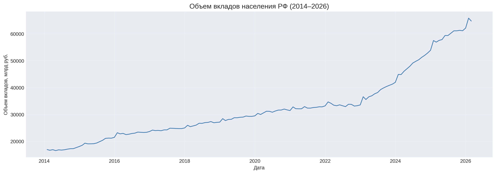
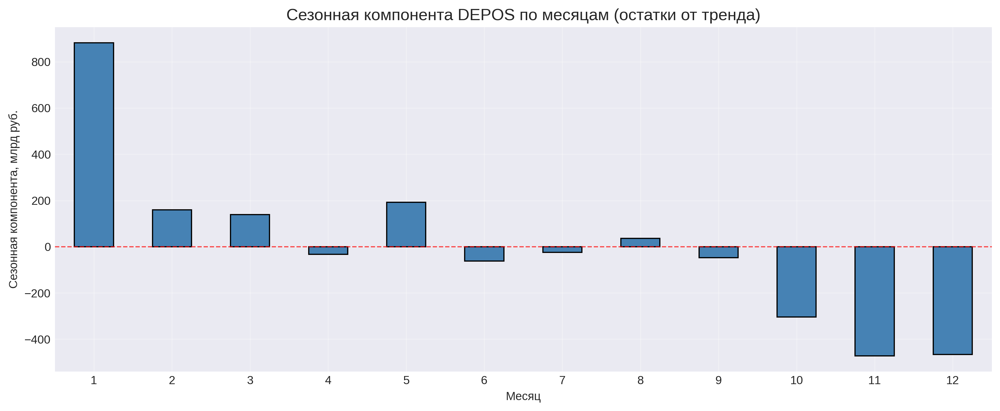
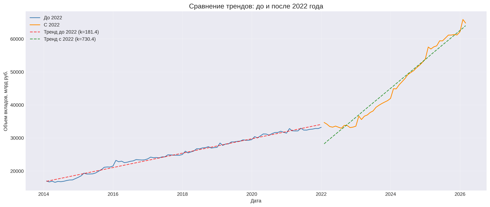

# 📊 Углубленный анализ временных рядов: прогнозирование вкладов населения РФ

**Проект:** Часть 2 — анализ временных рядов  
**Автор:** Надежда Силкина  
**Дата:** 2026  

---

## 📌 Содержание

1. [Декомпозиция временного ряда](#1-декомпозиция-временного-ряда)
   - [Тренд](#-тренд)
   - [Сезонность](#-сезонность)
   - [Остатки (шум)](#-остатки-шум)
2. [Структурные изменения](#2-структурные-изменения)
   - [Тест Чоу на структурный разрыв](#-тест-чоу-chow-test-на-структурный-разрыв)
   - [Сравнение трендов: до и после 2022 года](#-сравнение-трендов-до-и-после-2022-года)
3. [Предварительные выводы для моделирования](#3-предварительные-выводы-для-моделирования)
4. [Следующие шаги](#4-следующие-шаги)

---

## 📌 Введение

Этот документ содержит результаты углубленного анализа временного ряда DEPOS (объем вкладов населения РФ). Анализ выполнен как продолжение первой части проекта (`01_EDA_Modeling_Deposits_Forecast.ipynb`).

**Цели:**
1. Декомпозировать ряд на тренд, сезонность и шум
2. Выявить сезонные паттерны
3. Обнаружить структурные изменения в динамике вкладов
4. Подготовить рекомендации для улучшения модели

---

## 1. Декомпозиция временного ряда

### 📈 Тренд

**Наблюдения:**
- Ряд демонстрирует устойчивый восходящий тренд на протяжении всего периода наблюдений.
- **Период 2014–2023:** тренд хорошо аппроксимируется линейной функцией.
- **С декабря 2022 года:** четкое изменение угла наклона — темпы роста значительно ускорились.

**Визуализация тренда:**

**Вывод:** Тренд не является строго линейным на всем периоде. Наблюдается **структурный разрыв** в конце 2022 года, что подтверждается тестом Чоу (p < 0.05).

---

### 🌊 Сезонность

**Метод анализа:**
- Использована аддитивная декомпозиция (`seasonal_decompose`, period=12)
- Сезонная компонента выделена методом скользящего среднего

<b>📋 Результаты (средние значения по месяцам)</b> (нажмите, чтобы развернуть)

  
| Месяц | Среднее значение (млрд руб.) | Сезонная компонента (млрд руб.) |
|-------|-------------------------------|--------------------------------|
| Январь | 33 866.2 | **+881.8** |
| Февраль | 33 431.9 | **+159.6** |
| Март | 31 123.2 | **+139.3** |
| Апрель | 31 241.8 | −33.0 |
| Май | 31 776.2 | **+192.6** |
| Июнь | 31 839.5 | −61.8 |
| Июль | 32 220.8 | −24.5 |
| Август | 32 618.0 | +35.8 |
| Сентябрь | 32 859.6 | −47.8 |
| Октябрь | 32 923.3 | −304.3 |
| Ноябрь | 33 049.4 | **−471.8** |
| Декабрь | 33 431.5 | −466.1 |

**Визуализация сезонной компоненты:**

**Ключевые выводы:**
- **Пик сезонности (по остаткам):** январь (+881.8 млрд руб.) — вероятно, связан с годовыми бонусами и переоформлением депозитов.
- **Минимум сезонности (по остаткам):** ноябрь (−471.8 млрд руб.) — возможно, связано с сезонным снятием средств перед праздниками.
- **Размах сезонных колебаний:** 1 353.6 млрд руб. (4.16% от среднего объема вкладов).
- **Характер:** сезонность умеренная, но статистически значимая.

**Вывод для моделирования:**
- Сезонность присутствует и может быть учтена с помощью фиктивных переменных (dummies) по месяцам.
- Наибольший вклад в сезонность дают январь (+881.8 млрд руб.) и ноябрь (−471.8 млрд руб.).
- Учет сезонности может улучшить точность прогноза на 1–2%.

---

### 📉 Остатки (шум)

**Наблюдения:**
- Остатки колеблются вокруг нуля, что говорит о корректности аддитивной модели.
- Периоды 2015–2016 и 2022–2023 показывают более высокую волатильность, что может быть связано с макроэкономическими кризисами.
- Нет явных систематических отклонений, что подтверждает качество декомпозиции.

**Вывод:** Остатки случайны, аддитивная модель подходит для данного ряда.

---

## 2. Структурные изменения

### 🔍 Тест Чоу (Chow Test) на структурный разрыв

**Гипотезы:**
- H₀: коэффициенты тренда одинаковы для всего периода
- H₁: коэффициенты тренда различаются до и после 2022 года

**Результаты:**
- F-статистика: 782.04
- p-значение: 0.0000 (< 0.05)

**Вывод:** Структурный разрыв статистически значим (p < 0.05). Тренд изменился после 2022 года.

---

### 📊 Сравнение трендов: до и после 2022 года

| Период | Угол наклона (млрд руб./месяц) | Изменение |
|--------|--------------------------------|-----------|
| До 2022 | 181.4 | — |
| С 2022 | 730.5 | **+302.6%** |

**Визуализация структурного разрыва:**

**Визуальное наблюдение:**
- До 2022 года рост был умеренным и стабильным.
- С декабря 2022 года темпы роста ускорились более чем в 4 раза.
- Это может быть связано с ростом ключевой ставки, ужесточением денежно-кредитной политики и переориентацией сбережений населения на депозиты.

**Рекомендация:** Обязательно добавить **фиктивную переменную `post_2022`** (0 до 2022 года, 1 после) во все последующие модели.

---

## 3. Предварительные выводы для моделирования

На основе анализа:
1. Ряд имеет устойчивый восходящий тренд, который ускорился после 2022 года (подтверждено тестом Чоу).
2. Сезонность присутствует: пик в январе, спад в ноябре. Размах ~1 353.6 млрд руб. (4.16% от среднего).
3. Остатки случайны, аддитивная модель подходит.

**Рекомендуемые признаки для следующей модели:**
- `post_2022` (фиктивная переменная) — **обязательно**
- `month_*` (фиктивные переменные для месяцев) — **рекомендуется**
- `trend` (порядковый номер месяца) — для учета линейного тренда

---

## 4. Следующие шаги

- [x] Декомпозиция временного ряда
- [x] Анализ сезонности (средние значения + сезонная компонента)
- [x] Тест Чоу на структурный разрыв
- [ ] Построение SARIMA-модели
- [ ] Добавление сезонных и структурных фиктивных переменных в Ridge
- [ ] Сравнение качества моделей (v1 vs v2)

---

*Этот документ будет дополняться по мере выполнения следующих блоков анализа.*
