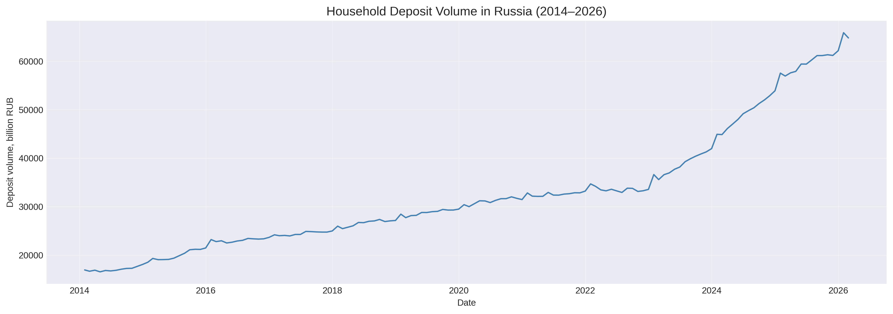
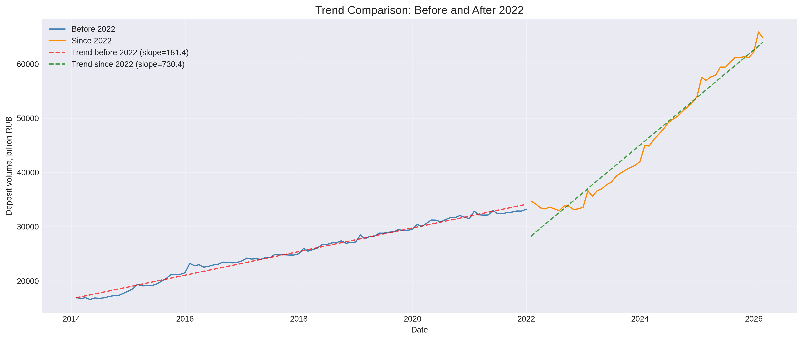

# 📊 Deep Time Series Analysis: Forecasting Household Deposits in Russia

**Project:** Part 2 — time series analysis  
**Author:** Nadezhda Silkina  
**Date:** 22.08.2026  

---

## 📌 Table of Contents

1. [Time Series Decomposition](#1-time-series-decomposition)
   - [Trend](#-trend)
   - [Seasonality](#-seasonality)
   - [Residuals (noise)](#-residuals-noise)
2. [Structural Changes](#2-structural-changes)
   - [Chow Test for Structural Break](#-chow-test-for-structural-break)
   - [Trend Comparison: Before and After 2022](#-trend-comparison-before-and-after-2022)
3. [Preliminary Modeling Conclusions](#3-preliminary-modeling-conclusions)
4. [Next Steps](#4-next-steps)

---

## 📌 Introduction

This document presents the results of an in-depth analysis of the DEPOS time series (household deposits in Russia). The analysis builds on the first part of the project (`01_EDA_Modeling_Deposits_Forecast.ipynb`).

**Objectives:**
1. Decompose the series into trend, seasonality, and noise
2. Identify seasonal patterns
3. Detect structural changes in deposit dynamics
4. Prepare recommendations for model improvement

---

## 1. Time Series Decomposition

### 📈 Trend

**Observations:**
- The series shows a sustained upward trend throughout the observation period.
- **2014–2023:** The trend is well approximated by a linear function.
- **From December 2022 onward:** A clear change in slope — the growth rate accelerated significantly.

**Trend Visualization:**

**Conclusion:** The trend is not strictly linear over the entire period. A **structural break** is observed at the end of 2022, confirmed by the Chow test (p < 0.05).

---

### 🌊 Seasonality

**Methodology:**
- Additive decomposition used (`seasonal_decompose`, period=12)
- Seasonal component extracted via moving average

<b>📋 Results (monthly averages)</b> (click to expand)

  
| Month | Mean value (billion RUB) | Seasonal component (billion RUB) |
|-------|--------------------------|----------------------------------|
| January | 33,866.2 | **+881.8** |
| February | 33,431.9 | **+159.6** |
| March | 31,123.2 | **+139.3** |
| April | 31,241.8 | −33.0 |
| May | 31,776.2 | **+192.6** |
| June | 31,839.5 | −61.8 |
| July | 32,220.8 | −24.5 |
| August | 32,618.0 | +35.8 |
| September | 32,859.6 | −47.8 |
| October | 32,923.3 | −304.3 |
| November | 33,049.4 | **−471.8** |
| December | 33,431.5 | −466.1 |

**Seasonal Component Visualization:**

**Key Findings:**
- **Seasonality peak (by residuals):** January (+881.8 billion RUB) — likely linked to annual bonuses and deposit rollovers.
- **Seasonality trough (by residuals):** November (−471.8 billion RUB) — possibly due to seasonal withdrawals before the holidays.
- **Range of seasonal fluctuations:** 1,353.6 billion RUB (4.16% of average deposit volume).
- **Nature:** Seasonality is moderate but statistically significant.

**Modeling Implication:**
- Seasonality is present and can be captured using monthly dummy variables.
- The largest seasonal contributions come from January (+881.8 billion RUB) and November (−471.8 billion RUB).
- Accounting for seasonality can improve forecast accuracy by 1–2% (✅ **confirmed in Block 4:** monthly dummies improved R² by up to +0.0281).

---

### 📉 Residuals (noise)

<b>📈 Chart: DEPOS Time Series Decomposition</b> (click to expand)

**Observations:**
- Residuals (bottom panel) fluctuate around zero, confirming the additive model is appropriate.
- No long-term trend — residuals show no systematic upward or downward bias.
- No clear patterns or cyclicality, indicating the residuals are random.
- Periods 2015–2016 and 2022–2023 show higher volatility, likely linked to macroeconomic crises.

**Conclusion:** Residuals are random; the additive model is suitable for this series.

---

## 2. Structural Changes

### 🔍 Chow Test for Structural Break

**Hypotheses:**
- H₀: Trend coefficients are the same across the entire period
- H₁: Trend coefficients differ before and after 2022

**Results:**
- F-statistic: 782.04
- p-value: 0.0000 (< 0.05)

**Conclusion:** The structural break is statistically significant (p < 0.05). The trend changed after 2022.

---

### 📊 Trend Comparison: Before and After 2022

| Period | Slope (billion RUB/month) | Change |
|--------|---------------------------|--------|
| Before 2022 | 181.4 | — |
| Since 2022 | 730.5 | **+302.6%** |

**Structural Break Visualization:**

**Visual Observation:**
- Before 2022, growth was moderate and stable.
- From December 2022, growth accelerated more than fourfold.
- This may be linked to rising key interest rates, tighter monetary policy, and a shift in household savings toward deposits.

**Recommendation:** Add a **`post_2022` dummy variable** (0 before 2022, 1 after) to all subsequent models.
✅ **Implemented in Block 4:** `post_2022` improved R² by +0.0427.

---

## 3. Preliminary Modeling Conclusions

Based on the analysis:
1. The series has a strong upward trend that accelerated after 2022 (confirmed by Chow test).
2. Seasonality is present: peak in January, trough in November. Range ~1,353.6 billion RUB (4.16% of average).
3. Residuals are random; the additive model is appropriate.

**Recommended features for the next model:**
- ✅ `post_2022` (dummy variable) — **implemented in Block 4** (+0.0427 R²)
- ✅ `month_*` (monthly dummy variables) — **implemented in Block 4** (up to +0.0281 R²)

---

## 4. Next Steps

- [x] Time series decomposition
- [x] Seasonality analysis (averages + seasonal component)
- [x] Chow test for structural break
- [ ] SHAP analysis and nonlinearity testing → [Block 3](key_insights_3.md)
- [ ] Add seasonal and structural dummy variables → [Block 4](key_insights_4.md)
- [ ] Build SARIMA model → [Block 5](key_insights_5.md)
- [ ] Final forecast for 2026-2027 → [Block 6](key_insights_6_itog.md)

---

*Document updated: 22.08.2026*
