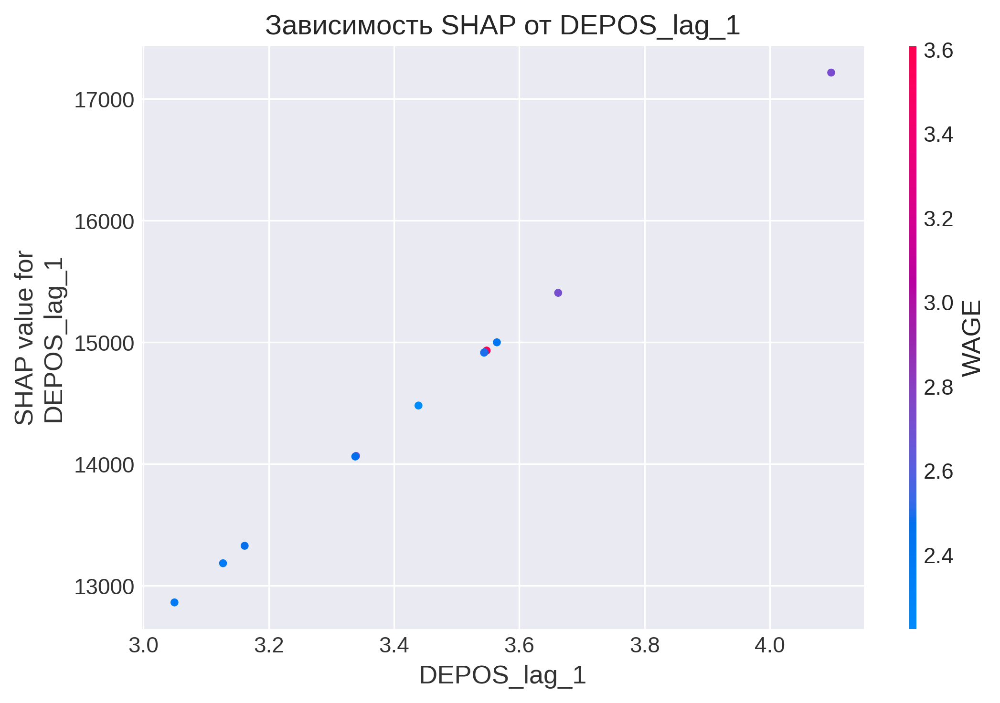

# 📊 Интерпретация моделей: SHAP-анализ и нелинейности

**Проект:** Часть 3 — интерпретация моделей  
**Автор:** Надежда Силкина  
**Дата:** 2026  

---

## 📌 Введение

Этот документ содержит результаты интерпретации моделей из первой части проекта. Основные задачи:
1. **SHAP-анализ** — определить, какие факторы реально влияют на вклады.
2. **Анализ нелинейностей** — проверить, есть ли нелинейные зависимости.
3. **Сравнение моделей** — оценить, стоит ли усложнять модель.

---

## 1. SHAP-анализ (Ridge-регрессия)

### 📊 Топ-5 признаков по важности

| Признак | SHAP-важность | Интерпретация |
|---------|---------------|---------------|
| **DEPOS_lag_1** | 14 531 | Сильнейший эффект — инерция вкладов |
| **DEPOS_lag_3** | 7 847 | Влияние сохраняется 3 месяца |
| **DEPOS_lag_6** | 3 865 | Влияние сохраняется 6 месяцев |
| **SERV** | 1 725 | Экономическая активность → рост вкладов |
| **DEPOS_lag_12** | 1 072 | Годовая инерция |

**Вывод:** Лаговые признаки доминируют. Это подтверждает, что вклады имеют сильную инерцию — ключевой фактор для прогнозирования.

---

### 📈 Направление влияния

- **Положительное влияние:** высокие значения признака → рост вкладов (`DEPOS_lag_1`, `SERV`, `DEP1`).
- **Отрицательное влияние:** высокие значения признака → снижение вкладов (`CPI`, `USDind`, `IPI`).

**Вывод:** Направления влияния согласуются с экономической логикой (лаговые признаки имеют положительное влияние, а инфляция и курс доллара — отрицательное).

---

### 📉 Зависимость SHAP от значения признака

На примере `DEPOS_lag_1` видно:
- Рост лага → рост влияния на прогноз, т.е. рост вкладов в прошлом месяце линейно увеличивает прогноз.
- Есть выбросы, требующие проверки.

**Вывод:** Влияние лагов линейно, но есть точки, которые стоит проверить на аномалии.

---

## 2. Анализ нелинейностей

### 🔍 Тест Рамсея (проверка пропущенных нелинейностей)

**Что это:** Тест Рамсея (RESET test) проверяет, есть ли в модели пропущенные нелинейные связи. Он добавляет степени предсказанных значений (y_pred², y_pred³) и проверяет, значимо ли улучшается модель.

**Результаты:**

| Показатель | Результат | Вывод |
|------------|-----------|-------|
| **y_pred²** | p = 0.0000 | ✅ Есть пропущенные нелинейности |
| **y_pred³** | p = 0.0000 | ✅ Есть пропущенные нелинейности |

**Важно:** Тест проверял **линейную модель** (не Ridge). Ridge уже компенсирует нелинейности через регуляризацию.

**Вывод:** Нелинейности статистически значимы, но их добавление в модель не улучшает качество (см. сравнение моделей ниже).

---

### 🔍 Проверка гипотез из EDA

**Метод:** Каждая гипотеза проверялась путем добавления соответствующего полиномиального признака в базовую линейную модель и сравнения R². Улучшение R² > 0.001 считалось подтверждением гипотезы.

| Гипотеза | Добавленный признак | Улучшение R² | Статус |
|----------|---------------------|--------------|--------|
| **Нелинейность UNEM** | `UNEM²` | +0.0030 | ✅ Подтверждена (слабо) |
| **Взаимодействие UNEM и DEP1** | `UNEM × DEP1` | +0.0212 | ✅ Подтверждена (слабо) |
| Нелинейность DEP1 | `DEP1²` | -0.0003 | ❌ Не подтверждена |
| Нелинейность SERV | `SERV²` | -0.9897 | ❌ Не подтверждена (мультиколлинеарность) |

**Вывод:** Нелинейность UNEM и её взаимодействие с DEP1 подтверждаются, но улучшение незначительное. Остальные гипотезы не дали улучшения.

---

## 3. Сравнение моделей

### 📊 Какие модели сравнивались

| Модель | Описание | Признаков |
|--------|----------|-----------|
| **Базовая (EDA)** | Ridge-регрессия (alpha=1.0) из первой части | 13 |
| **Все полиномы** | Все квадраты и взаимодействия (degree=2) | 104 |
| **Lasso (отбор)** | Lasso-регуляризация для отбора признаков | 98 |
| **Гипотезы EDA** | Только признаки из EDA-гипотез | 17 |
| **Stepwise (отбор)** | Пошаговый отбор лучших 10 признаков | 10 |

**Результаты:**

| Модель | R² | RMSE | Признаков | Статус |
|--------|-----|------|-----------|--------|
| **Базовая (EDA)** | **0.8433** | **932** | 13 | 🏆 Лучшая |
| Все полиномы | -32.34 | 13 596 | 104 | ❌ Переобучена |
| Lasso (отбор) | -6.07 | 6 261 | 98 | ❌ Переобучена |
| Гипотезы EDA | -0.13 | 2 500 | 17 | ❌ Хуже базовой |
| Stepwise | 0.8287 | 974 | 10 | ⚠️ Чуть хуже базовой |

**Вывод:** Базовая линейная модель (Ridge) остается лучшей. Добавление полиномов ухудшает качество.

---

## 4. Итоговые выводы

1. **Ridge-регрессия остается лучшей моделью** (R² = 0.8433).
2. **Лаговые признаки** — главные драйверы вкладов.
3. **Нелинейности есть**, но их добавление не улучшает модель.
4. **UNEM** показывает слабую нелинейность, но эффект мал.
5. **Полиномиальные признаки** приводят к переобучению.

**Рекомендация:** Оставить линейную модель. В следующих блоках добавить:
- Фиктивные переменные для сезонности и структурных разрывов
- SARIMA / Prophet для сравнения с классическими временными рядами

---

## 4. Следующие шаги

- [x] SHAP-анализ
- [x] Анализ нелинейностей
- [x] Тест Рамсея
- [ ] Фиктивные переменные (сезонность, структурные разрывы)
- [ ] SARIMA / Prophet
- [ ] Сравнение всех моделей

---

*Этот документ будет дополняться по мере выполнения следующих блоков.*
