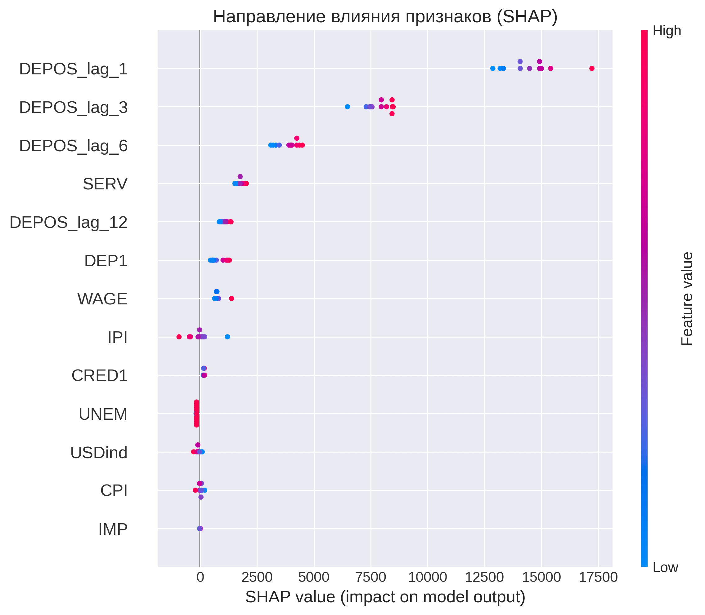

# 📊 Интерпретация моделей: SHAP-анализ и нелинейности

**Проект:** Часть 3 — интерпретация моделей  
**Автор:** Надежда Силкина  
**Дата:** 18.08.2026  

---

## 📌 Содержание

- [Введение](#введение)
- [1. SHAP-анализ](#1-shap-анализ-ridge-регрессия)
- [2. Анализ нелинейностей](#2-анализ-нелинейностей)
- [3. Итоговые выводы](#3-итоговые-выводы)
- [4. Следующие шаги](#4-следующие-шаги)

---

## 📌 Введение

Этот документ содержит результаты интерпретации моделей из первой части проекта. Основные задачи:
1. **SHAP-анализ** — определить, какие факторы реально влияют на вклады.
2. **Анализ нелинейностей** — проверить, есть ли нелинейные зависимости.
3. **Сравнение моделей** — оценить, стоит ли усложнять модель.

---

## 1. SHAP-анализ (Ridge-регрессия)

### 📊 Топ-5 признаков по важности

| Признак | SHAP-важность | Интерпретация |
|---------|---------------|---------------|
| **DEPOS_lag_1** | 14 531 | Сильнейший эффект — инерция вкладов |
| **DEPOS_lag_3** | 7 847 | Влияние сохраняется 3 месяца |
| **DEPOS_lag_6** | 3 865 | Влияние сохраняется 6 месяцев |
| **SERV** | 1 725 | Экономическая активность → рост вкладов |
| **DEPOS_lag_12** | 1 072 | Годовая инерция |

**Вывод:** Лаговые признаки доминируют. Это подтверждает, что вклады имеют сильную инерцию — ключевой фактор для прогнозирования.

---

### 📈 Направление влияния

- **Положительное влияние:** высокие значения признака → рост вкладов (`DEPOS_lag_1`, `SERV`, `DEP1`).
- **Отрицательное влияние:** высокие значения признака → снижение вкладов (`CPI`, `USDind`, `IPI`).

**Вывод:** Направления влияния согласуются с экономической логикой (лаговые признаки имеют положительное влияние, а инфляция и курс доллара — отрицательное).

---

### 📉 Зависимость SHAP от значения признака

На примере `DEPOS_lag_1` видно:
- Рост лага → рост влияния на прогноз, т.е. рост вкладов в прошлом месяце линейно увеличивает прогноз.
- Есть выбросы, требующие проверки.

**Вывод:** Влияние лагов линейно, но есть точки, которые стоит проверить на аномалии.

---

## 2. Анализ нелинейностей

### 🔍 Тест Рамсея (проверка пропущенных нелинейностей)

**Что это:** Тест Рамсея (RESET test) проверяет, есть ли в модели пропущенные нелинейные связи. Он добавляет степени предсказанных значений (y_pred², y_pred³) и проверяет, значимо ли улучшается модель.

**Результаты:**

| Показатель | F-статистика | p-значение | Вывод |
|------------|-------------|------------|-------|
| **y_pred²** | 4537.57 | 0.0000 | ✅ Пропущенные нелинейности |
| **y_pred³** | 1309.32 | 0.0000 | ✅ Пропущенные нелинейности |

**Интерпретация:** Тест обнаружил статистически значимые нелинейности. Однако, как показано ниже, их прямое добавление в модель приводит к переобучению из-за малого размера выборки (n=122).

**Важно:** Тест проверял **линейную модель** (не Ridge). Ridge уже компенсирует нелинейности через регуляризацию.

---

### 🔍 Модели для проверки нелинейностей

| Модель | Описание | Признаков |
|--------|----------|-----------|
| **Базовая (Linear)** | Линейная регрессия без регуляризации | 13 |
| **Все полиномы** | Все квадратичные признаки и взаимодействия (degree=2) | 104 |
| **Lasso (отбор)** | L1-регуляризация для автоматического отбора из 104 полиномов | 98 |
| **Гипотезы EDA** | DEP1², UNEM², UNEM×DEP1, SERV² (из EDA-гипотез) | 17 |
| **Stepwise (отбор)** | Пошаговый отбор 10 лучших признаков из 17 | 10 |

### 📊 Сравнительная таблица моделей

**Метрики на обучающей выборке (n=122):**

| Модель | Признаков | R²_train | R²_adj_train | AIC | BIC |
|--------|-----------|----------|--------------|-----|-----|
| Базовая (Linear) | 13 | 0.9972 | 0.9968 | 1889.06 | 1928.32 |
| Все полиномы | 104 | 0.9998 | 0.9988 | 1948.19 | 2242.61 |
| Lasso (отбор) | 98 | 0.9993 | 0.9961 | 2077.59 | 2355.19 |
| Гипотезы EDA | 17 | 0.9975 | 0.9970 | 1887.82 | 1938.29 |
| **Stepwise (отбор)** | **10** | **0.9971** | **0.9968** | **1882.04** | **1912.89** |

**Метрики на тестовой выборке (n=12):**

| Модель | R²_test | RMSE_test | R²_gap* |
|--------|---------|-----------|---------|
| **Базовая (Linear)** | **0.8433** | **932.00** | **0.1538** |
| Все полиномы | -32.34 | 13 597 | 33.34 |
| Lasso (отбор) | -6.07 | 6 261 | 7.07 |
| Гипотезы EDA | -0.13 | 2 500 | 1.12 |
| Stepwise (отбор) | 0.8287 | 974.44 | 0.1684 |

**\*R²_gap** = R²_train - R²_test — разница между качеством на обучающей и тестовой выборках. Большой R²_gap указывает на переобучение.

### 🏆 Лучшие модели по разным критериям

| Критерий | Победитель | Значение |
|----------|------------|----------|
| **R²_train** | Все полиномы | 0.9998 |
| **R²_test** | Базовая (Linear) | 0.8433 |
| **AIC** | Stepwise (отбор) | 1882.04 |
| **BIC** | Stepwise (отбор) | 1912.89 |

**Вывод:** Критерии расходятся:
- R²_test выбирает базовую модель (лучшая прогнозная способность)
- AIC/BIC выбирают Stepwise (лучший баланс качество/сложность)
- Все полиномы побеждают по R²_train, но полностью проваливаются на тестовой выборке

### 📊 Анализ переобучения

| Модель | R²_gap | Статус |
|--------|--------|--------|
| Базовая (Linear) | 0.1538 | ⚠️ Умеренное |
| Все полиномы | 33.34 | ❌ КРИТИЧЕСКОЕ |
| Lasso (отбор) | 7.07 | ❌ КРИТИЧЕСКОЕ |
| Гипотезы EDA | 1.12 | ❌ СИЛЬНОЕ |
| Stepwise (отбор) | 0.1684 | ⚠️ Умеренное |

---

### 🔍 Детальная проверка гипотез из EDA

**Метод:** Каждая гипотеза проверялась отдельно — добавлялся один признак к базовой модели, и оценивалось изменение метрик на обучающей и тестовой выборках.

| Гипотеза | Признак | ΔR²_train | ΔR²_test | ΔAIC | ΔR²_gap |
|----------|---------|-----------|----------|------|---------|
| DEP1² | DEP1_sq | +0.0000 | -0.0003 | +3.13 | +0.0003 |
| UNEM² | UNEM_sq | +0.0000 | +0.0030 | +2.45 | -0.0030 |
| UNEM × DEP1 | UNEM_DEP1 | +0.0001 | +0.0212 | +0.69 | -0.0211 |
| SERV² | SERV_sq | +0.0002 | -0.9897 | -4.39 | +0.9899 |

**Интерпретация показателей:**
- **ΔR²_train > 0** — модель лучше объясняет обучающие данные
- **ΔR²_test > 0** — модель лучше предсказывает новые данные
- **ΔAIC < 0** — модель лучше с учетом штрафа за сложность
- **ΔR²_gap > 0** — увеличилось переобучение

**Выводы по каждой гипотезе:**

1. **DEP1²** — ❌ НЕ ПОДТВЕРЖДЕНА: не дает улучшения ни на одной выборке

2. **UNEM²** — ⚠️ ЧАСТИЧНО: улучшает прогноз (ΔR²_test = +0.0030), но AIC ухудшился (ΔAIC = +2.45). Рост качества не компенсирует усложнение модели.

3. **UNEM × DEP1** — ⚠️ ЧАСТИЧНО: улучшает прогноз (ΔR²_test = +0.0212), но AIC ухудшился (ΔAIC = +0.69). Это лучшая из гипотез, но улучшение недостаточно для оправдания дополнительной сложности.

4. **SERV²** — ❌ НЕ ПОДТВЕРЖДЕНА: значительно ухудшает тестовую выборку (ΔR²_test = -0.9897) из-за мультиколлинеарности с SERV.

**Общий вывод:** Ни одна из EDA-гипотез не дает значимого улучшения. Нелинейности существуют (тест Рамсея), но их прямое добавление приводит к переобучению.

---

## 3. Итоговые выводы

1. **Базовая линейная модель остается лучшей** по прогнозной способности (R²_test = 0.8433)
2. **Лаговые признаки** — главные драйверы вкладов (по SHAP-анализу)
3. **Тест Рамсея обнаружил нелинейности**, но их добавление приводит к переобучению
4. **UNEM × DEP1** — единственная гипотеза с заметным улучшением R²_test (+0.0212), но AIC ухудшился
5. **Все полиномиальные модели переобучены** (R²_gap > 1)
6. **Stepwise-модель** имеет лучший AIC/BIC, но чуть худший R²_test (0.8287 vs 0.8433)
   → В **Block 4** Ridge с 38 признаками показывает R²_test = 0.9422.

**Рекомендация:** Оставить линейную модель. В следующих блоках добавить:
- Фиктивные переменные для сезонности и структурных разрывов (Block 4)
- SARIMA / Prophet для сравнения с классическими временными рядами

---

## 4. Следующие шаги

- [x] SHAP-анализ
- [x] Анализ нелинейностей с полными метриками
- [x] Тест Рамсея
- [x] Проверка EDA-гипотез с полными метриками
- [ ] Фиктивные переменные (сезонность, структурные разрывы) → [Block 4](key_insights_4.md)
- [ ] SARIMA / Prophet → [Block 5](key_insights_5.md)
- [ ] Финальный прогноз на 2026-2027 → [Block 6](key_insights_6_itog.md)

---

*Документ обновлен: 18.08.2026 (добавлено содержание, ссылки на следующие блоки)*
