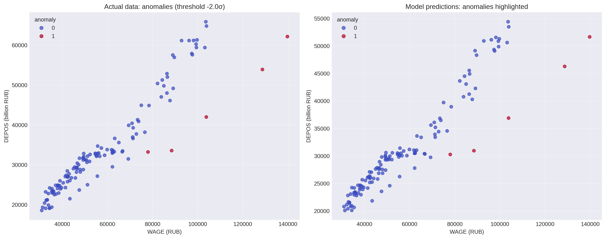
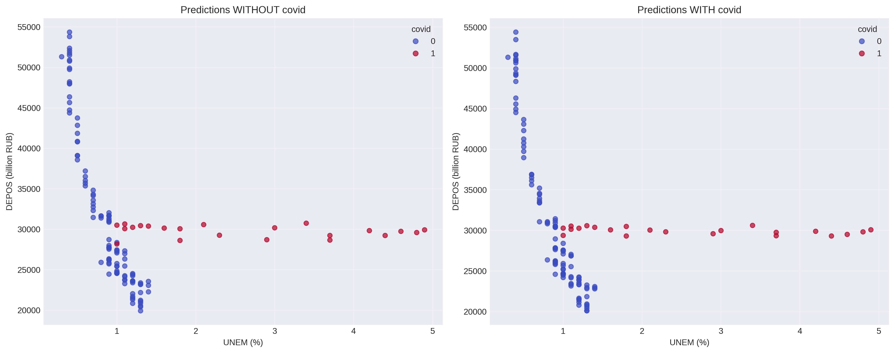
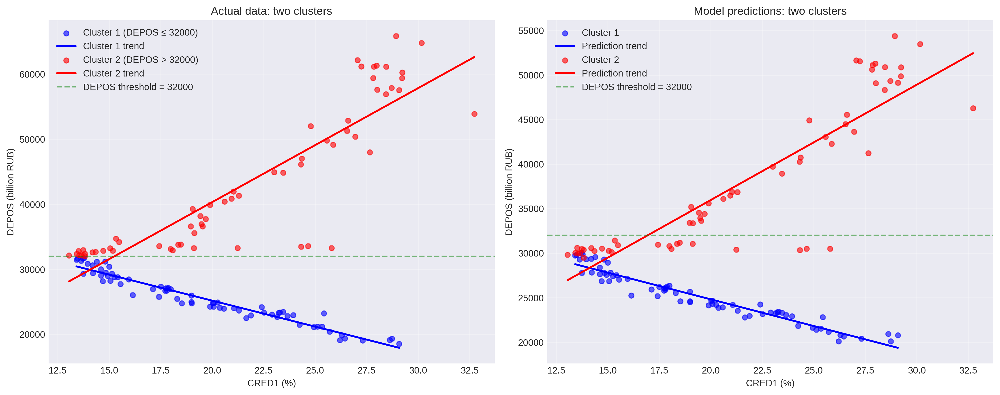
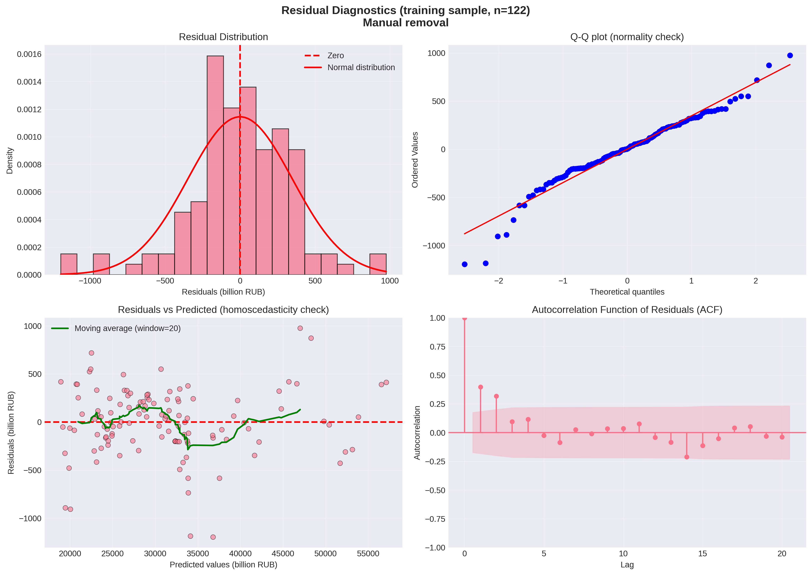

# 📊 Feature Engineering: Adding New Features

**Project:** Part 4 — creating and evaluating new features  
**Author:** Nadezhda Silkina  
**Date:** 22.08.2026  
**Version:** 2.4 (links to subsequent blocks added)

---

## 📌 Table of Contents

1. [Baseline Results](#1-baseline-results)
2. [Added Features](#2-added-features)
3. [Results of the Model with New Features](#3-results-of-the-model-with-new-features)
4. [Analysis of Each New Feature](#4-analysis-of-each-new-feature)
5. [Special Cases](#5-special-cases)
6. [Removing Insignificant Features](#6-removing-insignificant-features-feature-selection)
7. [Final Conclusions](#7-final-conclusions)
8. [Methodological Lessons](#8-methodological-lessons)
9. [Next Steps](#9-next-steps)

---

## 📌 Introduction

This document presents the results of adding new features to the model for forecasting household deposits in Russia.  
The goal is to improve prediction quality by accounting for:
- Seasonality
- Structural changes (2022)
- Lag effects for macro factors
- Specific nonlinearities identified in EDA

<b>📋 Important Methodological Note (v2.4)</b> (click to expand)

- All goodness-of-fit metrics (R²_train, R²_adj, AIC, BIC) are calculated on the **training sample** (n=122)
- Predictive ability (R²_test, RMSE, MAE) is evaluated on the **test sample** (n=12)
- **R²_gap = R²_train − R²_test** — overfitting indicator (larger means worse generalization)
- Residual diagnostics are performed strictly on the **training sample**
- F-test is excluded from the analysis (invalid for Ridge regression)
- Durbin-Watson test is replaced with the **Breusch-Godfrey test** (valid with lagged variables)

---

## 1. Baseline Results

**Model:** Baseline Ridge regression (alpha=1.0), 13 features.

| Metric | Value |
|---------|----------|
| **R² (test)** | 0.8486 |
| **RMSE (test)** | 916.32 billion RUB |
| **MAE (test)** | 807.96 billion RUB |

*Full metrics of the baseline model (including training sample and diagnostics) can be found in [key_insights.md](key_insights.md)*

---

## 2. Added Features

### 🧠 Rationale for Creating New Features

During previous stages (EDA, decomposition, SHAP analysis), the following patterns requiring attention were identified:

- **Seasonality**: decomposition showed regular annual fluctuations (peak in January, trough in November).
- **Structural break**: Chow test confirmed a significant trend change after 2022.
- **Lag effects**: SHAP analysis showed that DEPOS lags are the strongest drivers. It is logical to test lags for other macro factors as well.
- **WAGE anomalies**: scatter plot DEPOS vs WAGE shows points deviating from the general trend.
- **CRED1 regime**: two clusters with different slopes are visible in DEPOS vs CRED1.
- **UNEM × DEP1 interaction**: the hypothesis from Block 3 showed potential significance.

| Group | Features | Count |
|--------|----------|------------|
| **Seasonality** | 11 monthly dummy variables (month_2 … month_12) | 11 |
| **Structural changes** | `post_2022` (from 2023) | 1 |
| **COVID-19** | `covid` (March 2020 — January 2022) | 1 |
| **CRED1 regime** | `regime_cred1` (DEPOS > 32000) | 1 |
| **WAGE anomalies** | `anomaly_wage` (adaptive threshold -2σ) | 1 |
| **Macro factor lags** | WAGE, CPI, USDind (lags 1, 3, 6) | 9 |
| **Interaction** | `UNEM_DEP1` | 1 |
| **Total** | | **25** |

---

## 3. Results of the Model with New Features

**Model:** Full Ridge regression (alpha=1.0), 38 features.

| Metric | Value | Change |
|---------|----------|-----------|
| **R² (test)** | **0.9422** | **+0.0936** |
| **RMSE (test)** | 566.09 billion RUB | −350.23 |
| **MAE (test)** | 489.89 billion RUB | −318.07 |
| **Features** | 38 | +25 |

**Conclusion:** Adding new features **significantly improved the model**. R² increased by 9.36 percentage points, error nearly halved.

---

## 4. Analysis of Each New Feature

**Method:** Each new feature was added individually to the baseline model. Impact was assessed by the change in R² on the test sample.

### 📊 Top-5 Features by R² Improvement

| Feature | R² Improvement | Interpretation |
|---------|--------------|---------------|
| **WAGE_lag_1** | +0.0815 | Wage lag (1 month) — strongest macroeconomic predictor |
| **post_2022** | +0.0427 | Structural shift after 2022 significantly changes deposit dynamics |
| **month_3** | +0.0281 | March seasonal effect (possibly tax payments or bonuses) |
| **anomaly_wage** | +0.0264 | Outliers in DEPOS/WAGE ratio (crisis periods) |
| **month_12** | +0.0226 | December seasonal effect (pre-New Year spending) |

<b>📋 Full List of Features with Improvements</b> (click to expand)

### 📈 Features That Provided Improvement

| Feature | R² Improvement | Status |
|---------|--------------|--------|
| WAGE_lag_1 | +0.0815 | ✅ Significant improvement |
| post_2022 | +0.0427 | ✅ Significant improvement |
| month_3 | +0.0281 | ✅ Moderate improvement |
| anomaly_wage | +0.0264 | ✅ Moderate improvement |
| month_12 | +0.0226 | ✅ Moderate improvement |
| UNEM_DEP1 | +0.0221 | ✅ Moderate improvement |
| month_4 | +0.0204 | ✅ Moderate improvement |
| month_5 | +0.0154 | ✅ Slight improvement |
| month_11 | +0.0084 | ✅ Slight improvement |
| covid | +0.0083 | ✅ Slight improvement |
| WAGE_lag_3 | +0.0069 | ✅ Slight improvement |
| month_2 | +0.0042 | ✅ Minimal improvement |
| CPI_lag_1 | +0.0021 | ✅ Minimal improvement |
| month_10 | +0.0020 | ✅ Minimal improvement |

### ℹ️ Features That Did Not Provide Improvement

| Feature | R² Improvement | Status |
|---------|--------------|--------|
| month_6 | +0.0008 | ℹ️ Neutral |
| month_9 | -0.0003 | ℹ️ Neutral |
| WAGE_lag_6 | -0.0005 | ℹ️ Neutral |
| USDind_lag_6 | -0.0008 | ℹ️ Neutral |
| month_7 | -0.0027 | ℹ️ Minor deterioration |
| CPI_lag_3 | -0.0032 | ℹ️ Minor deterioration |
| USDind_lag_1 | -0.0095 | ℹ️ Minor deterioration |
| month_8 | -0.0104 | ℹ️ Minor deterioration |
| CPI_lag_6 | -0.0139 | ⚠️ Moderate deterioration |
| USDind_lag_3 | -0.0185 | ⚠️ Moderate deterioration |
| **regime_cred1** | **-0.1148** | ❌ **Significant deterioration** |

---

## 5. Special Cases

<b>5.1. WAGE Anomalies (anomaly_wage)</b> (click to expand)

**What we wanted to account for:**  
The DEPOS vs WAGE scatter plot shows a group of points deviating from the main linear trend (especially at high wages). We hypothesized that these might be crisis periods or structural shifts that the model should account for separately.

**Method:**  
Adaptive threshold selection (testing from -1σ to -2σ). For each threshold, a dummy variable `anomaly_wage = 1` was created for points with residuals below the threshold.

| Threshold | Anomalies | R² (test) | Improvement |
|-------|----------|-----------|-----------|
| -1.0σ | 17 | 0.8729 | +0.0243 |
| -1.2σ | 10 | 0.8736 | +0.0250 |
| -1.5σ | 8 | 0.8748 | +0.0262 |
| **-2.0σ** | **5** | **0.8750** | **+0.0264** |

**Conclusion:** The best threshold is **-2.0σ** (5 anomalies). The feature provides consistent improvement, but its contribution is modest. The strict threshold allows isolating only the most pronounced deviations.

<b>5.2. COVID-19 (covid)</b> (click to expand)

**What we wanted to account for:**  
EDA revealed anomalies during the pandemic period (March 2020 — January 2022). We hypothesized that the structure of relationships between factors might have changed during this period.

**Result:** R² improvement of **+0.0083** — weak but positive. This suggests that COVID-19 had an impact, but it was relatively small and partially already captured by other features (e.g., lags).

<b>5.3. CRED1 Regime (regime_cred1)</b> (click to expand)

**What we wanted to account for:**  
The DEPOS vs CRED1 plot shows two clusters with different slopes (points diverging from DEPOS ≈ 32000). We hypothesized that these might be different economic regimes requiring separate consideration.

**Result:** The feature **worsened** the model (R² dropped by 0.1148). This means that splitting into two clusters by DEPOS does not improve predictive ability.

**Reason:** Ridge already accounts for nonlinearities through regularization. Adding a rigid cluster split leads to loss of generalization ability. The feature creates an artificial break that is not supported by the data.

**Important clarification:** Although `regime_cred1` worsens the model when added in isolation (ΔR² = -0.1148), in the full model (38 features) its negative effect is compensated through interactions with other features. Therefore, it is **included** in the final model.

---

## 6. Removing Insignificant Features (Feature Selection)

### 6.1. Comparison Table of All Models

| Model | Features | R²_train | R²_adj_train | AIC | BIC | R²_test | RMSE_test | R²_gap |
|--------|-----------|----------|--------------|-----|-----|---------|-----------|--------|
| Baseline Ridge | 13 | 0.9963 | 0.9959 | 1919.49 | 1958.75 | 0.8486 | 916.32 | 0.1477 |
| **Full Ridge (all features)** | **38** | **0.9987** | **0.9981** | **1875.54** | 1984.90 | **0.9422** | **566.09** | **0.0565** |
| Manual removal | 30 | 0.9984 | 0.9979 | 1872.30 | 1959.22 | 0.7242 | 1236.69 | 0.2742 |
| Stepwise selection | 3 | 0.9961 | 0.9959 | 1897.64 | **1908.85** | 0.8192 | 1001.20 | 0.1769 |

**Note:**
- R²_train, R²_adj_train, AIC, BIC are calculated on the **training sample** (n=122)
- R²_test, RMSE_test — on the **test sample** (n=12)
- **R²_gap = R²_train − R²_test** — overfitting indicator

**R²_gap Analysis:**
- **Full Ridge: 0.0565** — minimal overfitting ✅
- Baseline Ridge: 0.1477 — moderate overfitting
- Stepwise selection: 0.1769 — elevated overfitting
- Manual removal: 0.2742 — strong overfitting ❌

### 6.2. Residual Diagnostics (Training Sample, n=122)

| Model | Normality (Shapiro-Wilk) | Homoscedasticity (Breusch-Pagan) | Autocorr. lag1 (Breusch-Godfrey) | Autocorr. lag4 (Breusch-Godfrey) |
|--------|---------------------------|----------------------------------|------------------------------|------------------------------|
| **Baseline Ridge (13)** | ✅ Normal (p=0.737) | ⚠️ Heteroscedastic (p=0.004) | ✅ None (p=0.320) | ⚠️ Present (p=0.000) |
| Full Ridge (38) | ⚠️ Deviation (p=0.020) | ✅ Homoscedastic (p=0.787) | ⚠️ Present (p=0.007) | ⚠️ Present (p=0.004) |
| Manual removal (30) | ⚠️ Deviation (p=0.002) | ✅ Homoscedastic (p=0.331) | ⚠️ Present (p=0.000) | ⚠️ Present (p=0.000) |
| Stepwise selection (3) | ⚠️ Deviation (p=0.009) | ⚠️ Heteroscedastic (p=0.001) | ⚠️ Present (p=0.001) | ⚠️ Present (p=0.012) |

### 6.3. Interpretation of Diagnostic Results

1. **Residual normality**: Only the baseline model has normal residuals (p=0.737). All more complex models show deviation from normality — this is the price for adding nonlinear features and interactions.

2. **Homoscedasticity**: The full model and manual removal successfully corrected the heteroscedasticity of the baseline model (p=0.004 → p=0.787). The stepwise model with 3 features cannot handle it.

3. **Residual autocorrelation**: Seasonal autocorrelation of the 4th order is present in **all models** without exception. Autocorrelation of the 1st order is absent only in the baseline model.

<b>📈 Visual Residual Diagnostics for "Manual Removal" Model</b> (click to expand)

**Interpretation:**

1. **Residual distribution (histogram):**
   - Visually, the bell shape does not align well with the normal distribution curve
   - There are protruding peaks and high extreme frequencies
   - This is confirmed by the Shapiro-Wilk test: **p = 0.0023** → deviation from normality ⚠️

2. **Q-Q plot:**
   - The main points follow the straight line, indicating approximate correspondence to normal distribution in the center
   - However, in the lower-left corner, **strong deviations** are observed — several points fall outside the general trend
   - This further confirms deviation from the normal distribution

3. **Residuals vs Predicted (homoscedasticity):**
   - The scatter is fairly uniform along the horizontal axis
   - However, **two points strongly deviated downward** (beyond ±1000 billion RUB) are noticeable
   - Despite this, the Breusch-Pagan test confirms homoscedasticity: **p = 0.3305** ✅
   - These outliers do not violate the overall uniformity of variance

4. **ACF of residuals (autocorrelation):**
   - **The first two lags are significant** (exceed the confidence interval)
   - The Breusch-Godfrey test confirms the presence of autocorrelation:
     - Lag 1: **p = 0.0000** ⚠️
     - Lag 4: **p = 0.0001** ⚠️
   - This means that the residuals are not independent — the temporal structure is not fully captured

**Conclusion:** Despite good diagnostic properties (homoscedasticity ✅), the "Manual removal" model has:
- Deviation from normality (p = 0.0023)
- Significant residual autocorrelation (lag 1 and lag 4)
- Low predictive ability (R²_test = 0.7242)

This confirms the choice of the **full Ridge model (38 features)** as the final one: although the "Manual removal" model has a lower AIC (1872.30 vs 1875.54), the full Ridge shows significantly better generalization (R²_gap = 0.0565 vs 0.2742) and predictive ability (R²_test = 0.9422 vs 0.7242).

**Key lesson:** AIC should not be the sole criterion for model selection. When AIC and predictive ability diverge, priority is given to R²_test and R²_gap — metrics that directly characterize the quality of forecasting on new data.

<b>6.4. Criteria Consensus</b> (click to expand)

| Model | Criteria won | Strengths |
|--------|---------------------------|-----------------|
| **Full Ridge (38)** | **3 out of 5** | R²_train, R²_adj_train, R²_test |
| Baseline Ridge (13) | 1 out of 5 | Best residual normality |
| Stepwise selection (3) | 1 out of 5 | Best BIC |

**Recommendation:** Full Ridge (38 features) — the best balance between forecast quality and statistical properties. R²_gap = 0.0565 confirms good generalization.

---

## 7. Final Conclusions

| Conclusion | Details |
|-------|--------|
| **New features significantly improved the model** | R²_test: 0.8486 → 0.9422 (+9.36 pp), RMSE: 916 → 566 (-38%) |
| **Minimal overfitting** | R²_gap = 0.0565 for full Ridge — best among all models |
| **Strongest feature** | `WAGE_lag_1` (+0.0815) — wage lag is critically important |
| **Structural break is important** | `post_2022` (+0.0427) — confirms the need to account for the shift |
| **Seasonality works** | Especially March (+0.0281) and December (+0.0226) |
| **WAGE anomalies provide improvement** | But only with a strict threshold (-2σ, 5 anomalies) |
| **COVID-19 — weak effect** | +0.0083, but positive |
| **regime_cred1 — significantly worsens** | −0.1148 (when added in isolation) |
| **Recommended model** | Full model (38 features) — 3 out of 5 criteria |
| **Heteroscedasticity fixed** | Baseline: ⚠️ (p=0.004) → Full: ✅ (p=0.787) |
| **Normality worsened** | Baseline: ✅ (p=0.737) → Full: ⚠️ (p=0.020) |
| **Seasonal autocorrelation not resolved** | Lag 4 significant in all models — requires separate methods |

---

## 8. Methodological Lessons

<b>📋 Expand methodological lessons</b>

1. **Sample splitting is critically important**: Goodness-of-fit metrics (R²_train, AIC, BIC) and residual diagnostics must be calculated on the training sample. The test sample is only for evaluating predictive ability.

2. **R²_gap is a key overfitting indicator**: The difference between R²_train and R²_test shows how overfitted the model is. Full Ridge has the minimum gap (0.0565), confirming its selection.

3. **Choice of statistical tests**: Not all classical tests apply to regularized models. F-test is invalid for Ridge, and DW-test is invalid for models with lags.

4. **Information criteria can diverge**: AIC and BIC can point to different models. When they diverge, it is recommended to analyze the consensus of multiple criteria.

5. **Improving one aspect may worsen another**: Full Ridge fixed heteroscedasticity but worsened residual normality. This is a normal trade-off in modeling.

6. **Residual autocorrelation is a signal for action**: The presence of 4th-order autocorrelation in all models indicates the need to move to specialized time series models (SARIMA).

---

## 9. Next Steps

- [x] Adding seasonal dummy variables
- [x] Adding `post_2022`
- [x] Adding `covid`
- [x] Testing `regime_cred1` (excluded)
- [x] Adding `anomaly_wage` with adaptive threshold
- [x] Adding lags for WAGE, CPI, USDind
- [x] Removing insignificant features (feature selection)
- [x] Fixing diagnostic methodology (v2.1)
- [x] Adding baseline model to comparison (v2.2)
- [x] Adding R²_gap and model name clarifications (v2.3)
- [ ] Accounting for residual autocorrelation (SARIMA) → [Block 5](key_insights_5.md)
- [ ] Final forecast for 2026-2027 → [Block 6](key_insights_6_itog.md)

---

*Document updated: 22.08.2026*
