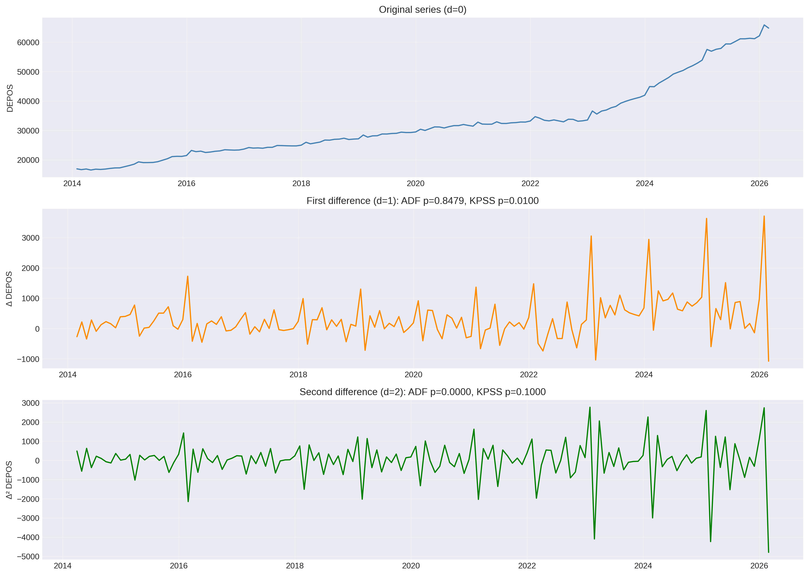
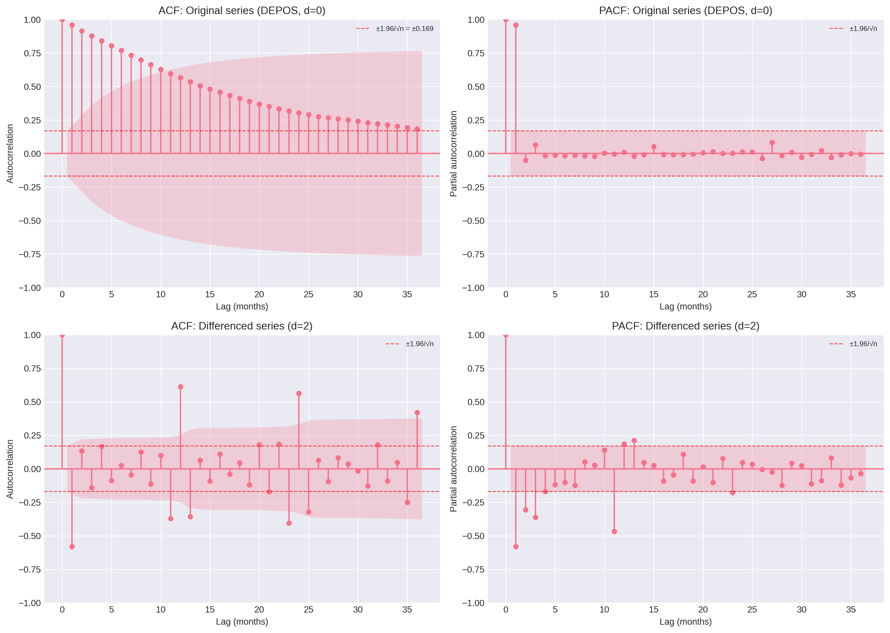
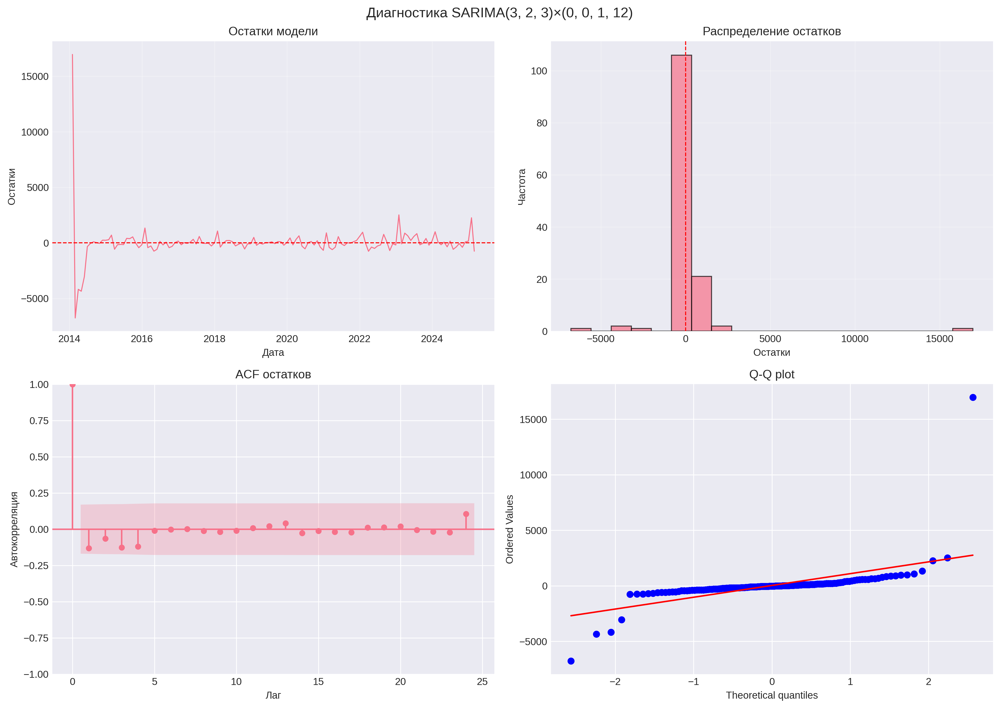
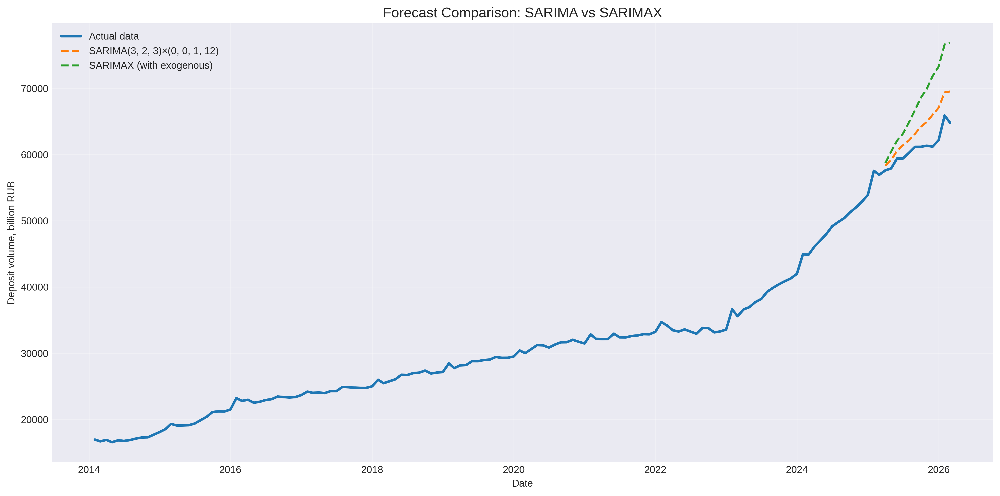
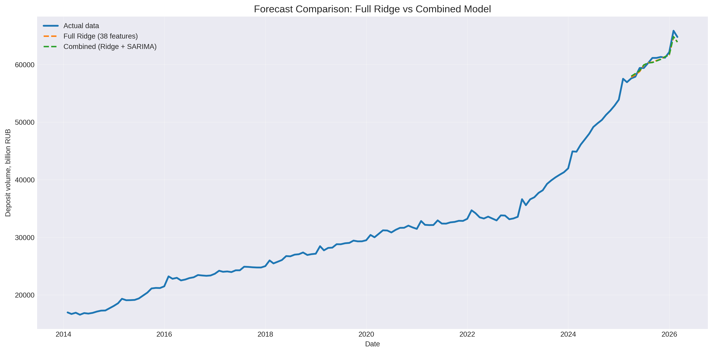
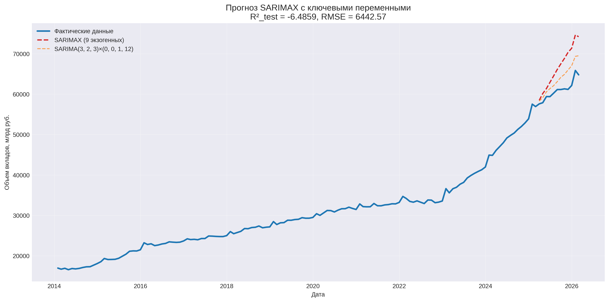

# 📊 Time Series Models: SARIMA

**Project:** Part 5 — time series modeling  
**Author:** Nadezhda Silkina  
**Date:** 22.08.2026  

---

## 📌 Table of Contents

1. [Methodological Justification](#1-methodological-justification)
2. [Stationarity Analysis](#2-stationarity-analysis-of-the-depos-series)
3. [ACF/PACF Analysis](#3-acfpacf-analysis-and-seasonality-identification)
4. [SARIMA Parameter Selection](#4-sarima-parameter-selection)
5. [SARIMA Diagnostics](#5-sarima-diagnostics)
6. [SARIMAX with Exogenous Variables](#6-sarimax-with-exogenous-variables)
7. [Combined Model](#7-combined-model-full-ridge--sarima)
8. [SARIMAX with Key Variables](#8-sarimax-with-key-variables)
9. [Final Comparison](#9-final-comparison-of-all-models)
10. [Final Conclusions](#10-final-conclusions)

---

## 📌 Introduction

This document presents the results of time series modeling using SARIMA, SARIMAX, and a combined model. Main objectives:
1. Justify the choice of SARIMA over Prophet
2. Build an optimal SARIMA model with uncorrelated residuals
3. Evaluate SARIMAX with exogenous variables (full and reduced sets)
4. Test the combined approach (Full Ridge + SARIMA)
5. Compare with the full Ridge model from Block 4 (38 features)

---

## 1. Methodological Justification

### 🔍 Problem: 4th-Order Autocorrelation

In all previous models (baseline Ridge, full Ridge with 38 features), residual diagnostics revealed significant 4th-order autocorrelation (Breusch-Godfrey test, p < 0.05).

| Model | BG test (lag 4) | p-value |
|--------|-----------------|---------|
| Baseline Ridge (13 features) | 25.05 | 0.0000 |
| Full Ridge (38 features) | 15.31 | 0.0037 |

### Why Not Prophet?

| Criterion | Prophet | SARIMA |
|----------|---------|--------|
| Autocorrelation modeling | ❌ No | ✅ Yes (AR/MA) |
| Seasonality | Fourier series | Seasonal AR/MA |
| Lagged error handling | ❌ No | ✅ Yes |
| Autocorrelation diagnostics | ❌ No | ✅ Ljung-Box |

**Conclusion:** SARIMA was chosen because it explicitly models autocorrelation — the key problem of all previous models.

---

## 2. Stationarity Analysis of the DEPOS Series

| Test | Statistic | p-value | Criterion | Conclusion |
|------|-----------|---------|----------|-------|
| ADF | 0.3935 | 0.9813 | p < 0.05 → stationary | Non-stationary ❌ |
| KPSS | 0.3104 | 0.0100 | p > 0.05 → stationary | Non-stationary ❌ |

**Note:** ADF and KPSS have opposite hypotheses:
- ADF: H₀ = series is non-stationary, H₁ = series is stationary
- KPSS: H₀ = series is stationary, H₁ = series is non-stationary

### Determining the Order of Differencing

| Difference | ADF stat | ADF p | KPSS p | Conclusion |
|----------|----------|-------|--------|-------|
| d=0 | 0.3935 | 0.9813 | 0.0100 | Non-stationary ❌ |
| d=1 | -0.6957 | 0.8479 | 0.0100 | Non-stationary ❌ |
| **d=2** | **-8.1477** | **0.0000** | **0.1000** | **Stationary ✅** |

**Conclusion:** Second-order differencing (d=2) is required.

<b>📈 Chart: Differencing Analysis</b> (click to expand)

**Observations:**
- Top panel (d=0): original series with a clear upward trend
- Middle panel (d=1): first difference — trend removed, but series still non-stationary (ADF p=0.8479)
- Bottom panel (d=2): second difference — series is stationary (ADF p=0.0000, KPSS p=0.1000)

---

## 3. ACF/PACF Analysis and Seasonality Identification

### Original Series (d=0)
- ACF: slowly decaying → non-stationarity
- PACF: significant peak only at lag 1

### Differenced Series (d=2)
- ACF: significant lags 1, 11, 12, 13, 23, 24...
- PACF: significant lags 1, 2, 3, 4, 11

**Conclusion:** The presence of significant lags 11, 12, 13, 23, 24 in ACF indicates **annual seasonality (s=12)**. Quarterly seasonality (s=4) is not confirmed.

<b>📈 Chart: ACF and PACF Analysis</b> (click to expand)

**How to read the charts:**
- Shaded area — 95% confidence interval (±1.96/√n)
- Red dashed lines — significance boundaries
- Bar exceeding the area → autocorrelation is significant (p < 0.05)
- Lag 0 is always 1 (series with itself) — ignore it
- Lag 1 is the first bar after lag 0

**Observations:**
- Original series (top): slowly decaying ACF confirms non-stationarity
- Differenced series (bottom): significant peaks at lags 11, 12, 13, 23, 24 → annual seasonality (s=12)

---

## 4. SARIMA Parameter Selection

### Grid Search

**What is Grid Search:** Automatic search through all parameter combinations (p, d, q)(P, D, Q, s) to find the optimal model.

| Parameter | Range | Description |
|----------|----------|----------|
| p (AR) | 0-3 | Autoregressive order |
| d (differencing) | 2 | Determined earlier |
| q (MA) | 0-3 | Moving average order |
| P (seasonal AR) | 0-1 | Seasonal autoregression |
| D (seasonal diff.) | 0-1 | Seasonal differencing |
| Q (seasonal MA) | 0-1 | Seasonal moving average |
| s (seasonality) | 12 | Annual seasonality (from ACF/PACF) |

**Total combinations:** 128

### Selection Criteria

**Primary criterion:** The model must have **uncorrelated residuals** (Ljung-Box p > 0.05). This ensures the model adequately describes the temporal structure.

**Secondary criterion:** Among models with uncorrelated residuals, select the one with the minimum AIC.

Out of 128 models, only **2 models** produced uncorrelated residuals:

| Model | AIC | R²_test | LB p | Residuals |
|--------|-----|---------|------|---------|
| **SARIMA(3,2,3)×(0,0,1,12)** | **1792.86** | **-0.7795** | **0.1245** | ✅ Uncorrelated |
| SARIMA(3,2,2)×(0,0,1,12) | 1805.81 | -0.8911 | 0.0797 | ✅ Uncorrelated |

**Selected:** SARIMA(3,2,3)×(0,0,1,12) — minimum AIC among models with uncorrelated residuals.

---

## 5. SARIMA Diagnostics

### Ljung-Box Test

| Lag | Statistic | p-value | Conclusion |
|-----|-----------|---------|-------|
| 4 | 7.2242 | 0.1245 | ✅ No autocorrelation |
| 8 | 7.2614 | 0.5087 | ✅ No autocorrelation |
| 12 | 7.4079 | 0.8295 | ✅ No autocorrelation |

**Conclusion:** ✅ Autocorrelation is completely eliminated. The model is statistically adequate.

### Forecast Quality

| Sample | R² | RMSE |
|---------|-----|------|
| Training (n=134) | 0.9645 | 1750.60 |
| Test (n=12) | -0.7795 | 3141.14 |

**Problem:** High R²_train but negative R²_test. The model fits history well but forecasts poorly.

<b>📈 Chart: SARIMA Diagnostics</b> (click to expand)

**Observations:**
- Residuals fluctuate around zero without clear patterns
- Histogram: strong peak near zero, no bell-shaped frequency decline — distribution does not resemble normal
- Jarque-Bera test: JB = 276.79, p = 0.0000 → normality hypothesis rejected
- Skewness (1.93) and Kurtosis (9.51) significantly deviate from zero
- Q-Q plot: points do not follow the straight line — systematic deviation observed; 4 strong deviation points on the left, one extreme on the right
- ACF of residuals: no significant peaks → autocorrelation eliminated

**Conclusion:** autocorrelation is absent, but the distribution is not normal.

---

## 6. SARIMAX with Exogenous Variables

### Methodological Note

**Redundancy of the variable set:** Initially, a full set of 48 exogenous variables was used (9 base + 27 lags + 11 seasonal + post_2022). This is **methodologically redundant** because:
- Feature-to-observation ratio: 48/128 = 1:2.7 — guaranteed overfitting
- Multicollinearity: lags are strongly correlated with each other
- Seasonal variables partially duplicate the SARIMA seasonal component (s=12)

**Correct approach:** Start with a minimal set (4-5 key variables from SHAP analysis) and gradually increase complexity if needed. Section 8 (9 key variables) is a step in the right direction, but still redundant.

### Configuration

- 48 exogenous variables (base + lags + seasonal + post_2022)
- Order: SARIMA(3,2,3)×(0,0,1,12)

### Results

| Sample | R² | RMSE | Ljung-Box p |
|---------|-----|------|-------------|
| Training (n=128) | 0.9735 | 1471.90 | — |
| Test (n=12) | -9.6049 | 7668.14 | 0.0000 |

**Problems:**
1. CRITICAL overfitting (R²_test = -9.6)
2. Autocorrelated residuals (LB p = 0.0000)
3. Significantly overestimated forecasts: mean +11.0% vs actual

**Reason:** 48 exogenous variables are too many for n=128. Multicollinearity and overfitting.

<b>📈 Chart: SARIMA vs SARIMAX</b> (click to expand)

**Visual analysis:**
- SARIMA confidence interval covers only part of the actual points but stays close to them
- SARIMAX forecast points are significantly higher than SARIMA and actual data
- SARIMAX produces highly overestimated forecasts

---

## 7. Combined Model: Full Ridge + SARIMA

### Method

1. Full Ridge (38 features from Block 4) forecasts DEPOS level
2. SARIMA models the Ridge residuals
3. Final forecast = Ridge + SARIMA(residuals)

### Results

| Model | R²_test | RMSE_test | MAE_test | LB p |
|--------|---------|-----------|----------|------|
| **Full Ridge (38 features)** | **0.9422** | **566.09** | **489.89** | 0.0037 ❌ |
| Combined (Ridge + SARIMA) | 0.9380 | 586.22 | 521.86 | **0.2982** ✅ |

**Mean values (test):**
- Actual: 61,015 billion RUB
- Full Ridge: 60,734 billion RUB (-0.5%)
- Combined: 60,770 billion RUB (-0.4%)

**Analysis:**
- R²_test differs slightly: 0.9422 vs 0.9380 (Δ = 0.0042)
- RMSE differs by 20 billion RUB (3.5%)
- MAE differs by 32 billion RUB (6.5%)

**Key advantage of the combined model:**
- **Eliminates residual autocorrelation** (LB p = 0.2982 vs 0.0037)
- Makes it **preferable for forecasting with confidence intervals**
- Residuals satisfy the independence assumption

**Recommendation:** For point forecasts, the difference is negligible, but for interval forecasts, the combined model is preferable.

<b>📈 Chart: Ridge vs Combined Model</b> (click to expand)

**Visual analysis:**
- Combined model and Ridge forecasts are practically identical
- Deviations between them are almost invisible on the chart
- Both models are very close to actual data

---

## 8. SARIMAX with Key Variables

### Configuration

Reduced set of 9 exogenous variables to combat overfitting:
- WAGE, CPI, UNEM, DEP1 (base)
- 1-month lags for each
- post_2022 (structural shift)

### Results

| Sample | R² | RMSE | Ljung-Box p |
|---------|-----|------|-------------|
| Training (n=133) | 0.8539 | 3537.01 | — |
| Test (n=12) | -6.4859 | 6442.57 | 0.0012 |

**Problems:**
1. Still critical overfitting (R²_test = -6.5)
2. Autocorrelated residuals (LB p = 0.0012)
3. Overestimated forecasts

**Conclusion:** Reducing variables from 48 to 9 did NOT solve the overfitting problem. SARIMAX is not suitable for this dataset (n=133). For further research, try 4-5 key variables without lags.

<b>📈 Chart: SARIMAX with Key Variables</b> (click to expand)

**Visual analysis:**
- SARIMAX (9 key) also produces overestimated forecasts
- Reducing variables did not solve the overfitting problem
- Forecast points are significantly higher than actual

---

## 9. Final Comparison of All Models

| Model | R²_test | RMSE_test | MAE_test | LB p | Status |
|--------|---------|-----------|----------|------|--------|
| SARIMA(3,2,3)×(0,0,1,12) | -0.7795 | 3141.14 | 2789.94 | 0.1245 | ✅ Uncorrelated residuals |
| SARIMAX (48 exogenous) | -9.6049 | 7668.14 | 6727.68 | 0.0000 | ❌ CRITICAL overfitting |
| SARIMAX (9 key) | -6.4859 | 6442.57 | 5703.11 | 0.0012 | ❌ Overfitting remains |
| **Full Ridge (38 features, Block 4)** | **0.9422** | **566.09** | **489.89** | 0.0037 | ✅ **Best point forecast** |
| **Combined (Ridge + SARIMA)** | **0.9380** | **586.22** | **521.86** | **0.2982** | ✅ **Best interval forecast** |

**Note:** 
- Full Ridge provides the best point metrics (R²_test = 0.9422)
- Combined model eliminates residual autocorrelation (LB p = 0.2982)
- Quality difference is negligible (ΔR² = 0.0042, ΔRMSE = 20 billion RUB)

---

## 10. Final Conclusions

### Key Achievements

1. **SARIMA solved the autocorrelation problem** — Ljung-Box p > 0.05 (main goal achieved)
2. **Annual seasonality identified** (s=12), not quarterly (s=4)
3. **Established that d=2** — the series requires second-order differencing
4. **Combined model eliminated Ridge residual autocorrelation** — LB p = 0.2982

### Limitations

1. **SARIMA cannot forecast** (R²_test < 0) — pure time series model does not capture the 2022-2023 structural shift
2. **SARIMAX (48) critically overfits** — excess variables
3. **SARIMAX (9) still overfitted** — reduction did not help
4. **Combined model slightly underperforms Ridge on point metrics** — ΔRMSE = 20 billion RUB

### Why SARIMAX Does Not Work

- Even 9 key variables cause overfitting with n=133
- Exogenous variables in SARIMAX require larger data volumes
- Structural shift 2022-2023 is not captured by time series models
- Ridge handles multicollinearity better through regularization

### Recommendations

| Task | Model | Justification |
|--------|--------|-------------|
| **Point forecast** | Full Ridge (38 features, Block 4) | R²_test = 0.9422 — best result |
| **Interval forecast** | Combined (Ridge + SARIMA) | Uncorrelated residuals (LB p = 0.2982) |
| **Understanding time structure** | SARIMA(3,2,3)×(0,0,1,12) | Uncorrelated residuals, model adequate |
| **SARIMAX with exogenous** | ❌ Not recommended | Overfitting with any variable set |

### Final Decision

- **For point forecasting:** BLOCK 4 (Full Ridge) — R²_test = 0.9422
- **For interval forecasting:** Combined model — uncorrelated residuals
- **BLOCK 5 (SARIMA)** — diagnostic tool for time structure analysis
- **SARIMAX rejected** as unsuitable for small samples (n < 200)

### Visual Observations

1. SARIMA confidence interval covers only part of the actual points
2. SARIMAX (48) and SARIMAX (9) produce overestimated forecasts
3. Full Ridge and Combined model practically coincide with actual data

---

*Document updated: 22.08.2026*
