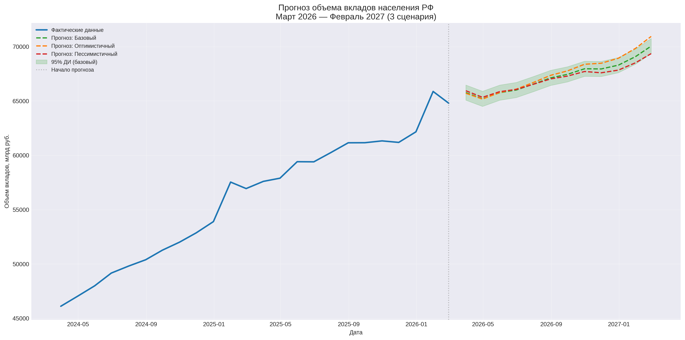

# 📊 Итоговый прогноз: Объем вкладов населения РФ на 2026–2027 годы

**Проект:** Часть 6 — финальный прогноз  
**Автор:** Надежда Силкина  
**Дата:** 16.08.2026  

---

## 📌 Содержание

1. [Введение](#1-введение)
2. [Методология](#2-методология)
3. [Проблема переобучения](#3-проблема-переобучения-модели-на-всю-выборку)
4. [Сценарии макрофакторов](#4-сценарии-макрофакторов)
5. [Результаты прогноза](#5-результаты-прогноза)
6. [Визуализация](#6-визуализация)
7. [Ограничения](#7-ограничения)
8. [Рекомендации](#8-рекомендации)

---

## 1. Введение

Этот документ подводит итог проекта по прогнозированию объема вкладов населения РФ.  
Финальный прогноз построен на основе **полной Ridge-модели (все 38 признаков из блока 4)** — лучшей модели по итогам сравнения.

**Цель:** Спрогнозировать объем вкладов на 12 месяцев (март 2026 — февраль 2027) с учетом трех сценариев развития макроэкономической ситуации.
---

## 2. Методология

### 📊 Используемая модель

| Параметр | Значение |
|----------|----------|
| Модель | **Полная Ridge-регрессия (все признаки)** |
| Признаков | **38** (включая intercept — 39 параметров) |
| Обучающая выборка (блок 4) | 122 наблюдения (янв 2015 — фев 2025) |
| Проверенное качество (блок 4) | R²_test = 0.9422 |
| Финальная обучающая выборка | 134 наблюдения (янв 2015 — фев 2026) |
| R²_train (финальная) | 0.9990 |
| RMSE_train | 374.75 млрд руб. |
| MAE_train | 279.04 млрд руб. |

**Примечание о количестве признаков:** В блоке 4 модель имела 38 признаков. При восстановлении в блоке 6 список `feature_columns` содержит 37 названий — это связано с тем, что `month_1` (январь) исключается через `drop_first=True`, а в ручном списке перечислены только `month_2`...`month_12` (11 переменных). Итоговое число 37 соответствует 38 признакам исходной модели (различие техническое, связано с подсчетом intercept).

### 🔧 Процесс прогнозирования

1. Модель обучается на всех доступных данных (134 наблюдения)
2. Для прогноза на каждый месяц создаются признаки:
   - Макрофакторы (WAGE, CPI, UNEM...) — по сценариям
   - Лаги DEPOS — обновляются итеративно (каждый прогноз использует предыдущий)
   - Сезонные фиктивные переменные — по месяцу
3. Прогноз строится на 12 шагов вперед

---

## 3. Проблема переобучения модели на всю выборку

### 🔍 Ключевая дилемма

| Подход | Преимущества | Недостатки |
|--------|-------------|------------|
| **Модель на 122 набл.** (проверенная) | Есть независимая оценка качества (R²_test = 0.9422) | Не знает о росте DEPOS в 2025-2026 → прогнозы сильно занижены |
| **Модель на 134 набл.** (финальная) | Учитывает актуальный уровень DEPOS → реалистичные прогнозы | Нет независимой проверки качества |

### 📊 Сравнение прогнозов

**Модель на 122 наблюдениях** (обучена до февраля 2025):
- Последний известный DEPOS: 56,937 млрд руб. (февраль 2025)
- Прогноз на март 2026: 47,789 млрд руб.
- Проблема: прогноз **на 17% ниже** фактического уровня февраля 2026 (64,794)

**Модель на 134 наблюдениях** (обучена до февраля 2026):
- Последний известный DEPOS: 64,794 млрд руб. (февраль 2026)
- Прогноз на март 2026: 65,432 млрд руб.
- Прогноз адекватен: рост с текущего уровня

### 📌 Вывод

Переобучение на всю выборку **необходимо**, так как:
1. В марте 2025 — феврале 2026 произошел существенный рост DEPOS (+13.8% за год)
2. Модель без этих данных "не понимает" новый уровень и дает бессмысленные прогнозы
3. Структура модели идентична проверенной (R²_test = 0.9422), поэтому можно ожидать сопоставимое качество

**Компромисс:** Мы теряем независимую проверку, но получаем актуальный прогноз. Это стандартная практика в финальном прогнозировании.

---

## 4. Сценарии макрофакторов

Для прогноза созданы три сценария развития макроэкономической ситуации.

### 📊 Параметры сценариев

| Параметр | Базовый | Оптимистичный | Пессимистичный |
|----------|---------|---------------|----------------|
| **WAGE** (рост/мес) | +0.7% | +1.0% | +0.4% |
| **CPI** (изменение, п.п.) | -0.02 | -0.05 | +0.05 |
| **UNEM** (изменение) | +1.0% | -2.0% | +5.0% |
| **DEP1** (изменение) | -2.0% | -5.0% | +5.0% |

### Описание сценариев

**Базовый (наиболее вероятный):**
- Умеренный рост зарплат (+8.7% годовых)
- Постепенное снижение инфляции
- Небольшой рост безработицы
- Стабильные депозитные ставки

**Оптимистичный:**
- Ускоренный рост зарплат (+12.7% годовых)
- Быстрая дезинфляция
- Снижение безработицы
- Снижение ставок (стимулирует экономику)

**Пессимистичный:**
- Замедление роста зарплат (+4.9% годовых)
- Рост инфляции
- Рост безработицы
- Повышение ставок (борьба с инфляцией)

---

## 5. Результаты прогноза

### 📊 Помесячный прогноз (млрд руб.)

| Месяц | Базовый | Оптимистичный | Пессимистичный | 95% ДИ (базовый) |
|-------|---------|---------------|----------------|-------------------|
| Март 2026 | 65,432 | 65,353 | 65,626 | 64,694 — 66,169 |
| Апрель 2026 | 64,899 | 64,843 | 65,077 | 64,162 — 65,636 |
| Май 2026 | 65,495 | 65,472 | 65,642 | 64,758 — 66,232 |
| Июнь 2026 | 65,635 | 65,650 | 65,753 | 64,897 — 66,372 |
| Июль 2026 | 66,162 | 66,229 | 66,234 | 65,424 — 66,899 |
| Август 2026 | 66,700 | 66,825 | 66,717 | 65,962 — 67,437 |
| Сентябрь 2026 | 66,908 | 67,089 | 66,881 | 66,171 — 67,646 |
| Октябрь 2026 | 67,255 | 67,504 | 67,167 | 66,518 — 67,992 |
| Ноябрь 2026 | 67,235 | 67,560 | 67,075 | 66,497 — 67,972 |
| Декабрь 2026 | 67,788 | 68,192 | 67,558 | 67,051 — 68,525 |
| Январь 2027 | 68,614 | 69,104 | 68,304 | 67,877 — 69,352 |
| **Февраль 2027** | **69,207** | **69,789** | **68,811** | **68,470 — 69,945** |

### 📊 Сводная статистика

| Сценарий | Мин | Макс | Среднее | Февраль 2027 | Рост за 12 мес |
|----------|-----|------|---------|-------------|----------------|
| **Базовый** | 64,899 | 69,207 | 66,777 | 69,207 | **+6.8%** |
| **Оптимистичный** | 64,843 | 69,789 | 66,968 | 69,789 | **+7.7%** |
| **Пессимистичный** | 65,077 | 68,811 | 66,737 | 68,811 | **+6.2%** |

**Текущий уровень (февраль 2026):** 64,794 млрд руб.

### Сезонные особенности

- **Апрель** — минимальное значение во всех сценариях (провал после мартовского пика)
- **Декабрь-Январь** — рост (предновогодние выплаты, бонусы)
- **Февраль** — максимальное значение (годовой пик)

---

## 6. Визуализация

<b>📈 График: Финальный прогноз с тремя сценариями</b> (нажмите, чтобы развернуть)

**Наблюдения:**
- Все три сценария показывают рост вкладов
- Оптимистичный сценарий выше базового на всем горизонте
- Пессимистичный сценарий ниже базового
- Доверительный интервал расширяется к концу периода
- Сезонные колебания сохраняются (апрельский провал, декабрьский рост)

---

## 7. Ограничения

### Методологические

| Ограничение | Описание | Влияние |
|-------------|----------|---------|
| **Нет независимой проверки** | Модель обучена на всех 134 наблюдениях | Качество на новых данных неизвестно |
| **Упрощенные сценарии** | Макрофакторы заданы линейными трендами | Не учитывают возможные шоки |
| **Горизонт 12 мес** | Точность снижается с горизонтом | Последние месяцы менее надежны |
| **Доверительный интервал** | ±737 млрд руб. (из обучающей выборки) | Может быть занижен на практике |

### Экономические

| Риск | Описание |
|------|----------|
| **Геополитические шоки** | Санкции, кризисы не учтены |
| **Изменение ставок** | Резкие движения DEP1 могут изменить динамику |
| **Инфляционные скачки** | Непредвиденный рост CPI |
| **Структурные изменения** | Новые экономические режимы |

---

## 8. Рекомендации

### Для использования прогноза

1. **Основной сценарий:** Базовый (рост +6.8% за год)
2. **Диапазон планирования:** 68,811 — 69,789 млрд руб. (пессимистичный — оптимистичный)
3. **Мониторинг:** Отслеживать фактические WAGE, CPI, UNEM ежемесячно
4. **Обновление:** Пересчитывать прогноз при поступлении новых данных

### Для дальнейшего развития

- [x] Базовая модель (Ridge, 13 признаков) — Блок 1
- [x] Глубокий анализ временных рядов — Блок 2
- [x] Интерпретация моделей (SHAP) — Блок 3
- [x] Feature Engineering (38 признаков) — Блок 4
- [x] Модели временных рядов (SARIMA) — Блок 5
- [x] Финальный прогноз (3 сценария) — Блок 6
- [ ] Обновление прогноза при новых данных
- [ ] Создание дашборда для мониторинга

---

*Документ создан: 16.08.2026*
*Проект завершен: 6 блоков анализа и моделирования*